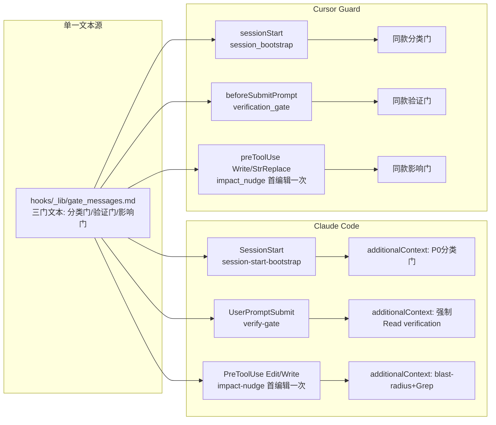

# v10.7.0 配置驱动门控优化计划

> 日期: 2026-07-30 | 决策: 变更影响门=首编辑注入提醒(不阻断)；版本=v10.7.0 minor | 原则: 不依赖模型自觉，规则由 hook 强制写入上下文

## 现状核实结论（已读源码确认）

- Claude Code `settings.json` hooks 仅有 PostToolUse/PreToolUse/Stop — **无 SessionStart、无 UserPromptSubmit 注册**（SessionStart 由 superpowers 插件兜底，本地 [session-start-bootstrap.py](C:/Users/DELL/.claude/hooks/session-start-bootstrap.py) 存在但未注册，README L25 自述"保留备用"）
- Cursor Guard 已部署且支持 `sessionStart`/`beforeSubmitPrompt`/`preToolUse` 的 `additional_context` 注入与 `permission: deny` 阻断（[explore_router.py](C:/Users/DELL/.claude/templates/cursor-guard/hooks/explore_router.py) L109 实证）
- [sync.ps1](C:/Users/DELL/.claude/scripts/sync.ps1) `-All` 模式已支持 rules 全量 verbatim 复制为 `.mdc`（L559-585），frontmatter 的 `description`/`globs` 键 Cursor 原生识别（`trigger:` 键为惰性元数据，不影响激活）— 无需写转换器
- [agent.yaml](C:/Users/DELL/.claude/agent.yaml) L180-192 漂移：mcp_loading 仍列 figma/puppeteer/glif；limits 与实际（rules 12 / skills 44）不符
- `stop-quality-gate.py` 为 Stop 事件，不适合做完成门（时机太晚）；完成门应走 UserPromptSubmit

## 门控架构（SSOT 文本 + 双端 hook 注入）

## 工作流

### W1 门文本 SSOT + Claude Code SessionStart 注册

- 新建 `hooks/_lib/gate_messages.md`：三段带标题文本（`## P0分类门` / `## 完成验证门` / `## 变更影响门`），内容提炼自 using-superpowers 决策树、verification-before-completion 触发词、change-impact-analysis 强制流程，各 ≤8 行
- 改 [session-start-bootstrap.py](C:/Users/DELL/.claude/hooks/session-start-bootstrap.py)：additionalContext 末尾追加 P0 分类门段（读 SSOT 文件，失败降级为内置兜底字符串，R16 不静默）
- 改 [settings.json](C:/Users/DELL/.claude/settings.json)：hooks 新增 `SessionStart` 组注册本地 bootstrap（与插件注入叠加，可接受）；新增 `UserPromptSubmit` 组（W3 用）

### W2 完成验证门（双端）

- 新建 `hooks/pre-userprompt-verify-gate.py`：prompt 命中关键词（完成|修好了|测试通过|done|声称完成，与 verification-before-completion triggers 对齐）→ additionalContext 注入「必须先 Read skills/verification-before-completion/SKILL.md 并实际运行验证命令后方可声称完成」；幂等无状态；未命中静默 exit 0
- settings.json `UserPromptSubmit` 注册之
- 新建 `templates/cursor-guard/hooks/verification_gate.py`（beforeSubmitPrompt）：同款逻辑，关键词读 guard-config.json 新增 `verification.prompt_keywords`；`templates/cursor-guard/hooks.json` 注册
- [guard-config.json](C:/Users/DELL/.claude/templates/cursor-guard/guard-config.json) 加 `verification` 配置块

### W3 变更影响门（双端，首编辑注入）

- 新建 `hooks/pre-edit-impact-nudge.py`（PreToolUse `Edit|Write|MultiEdit`）：按 session_id 状态文件（`~/.claude/.state/impact-nudge.json`，复用 context_cache 模式）判断本会话首次编辑 → 注入「改前先 codegraph blast-radius + Grep 引用，Read skills/change-impact-analysis/SKILL.md」；非首次静默；**永不 deny**（用户决策）
- settings.json PreToolUse 注册（独立 matcher 组，不与现有组混排）
- 新建 `templates/cursor-guard/hooks/impact_nudge.py`（preToolUse `Write|StrReplace`）：同款逻辑，状态走 Guard `state_path`；hooks.json 注册

### W4 Cursor Guard 重部署 + rules/skills 全量同步

- 跑 `scripts/deploy-cursor-guard.ps1`：部署 W2/W3 新 hook 与配置到 `~/.cursor/`
- 跑 `sync.ps1 -All`：9 个 model_decision rules + FRONTEND 全量部署为 `~/.cursor/rules/*.mdc`（verbatim 即可激活 agent-requested/glob）；skills/ 目录同步供 Cursor 发现
- 验证 `~/.cursor/rules/` .mdc 数量 = 12 rules + ROUTER + CURSOR-EDITOR；抽查 GOVERNANCE.mdc frontmatter 完整

### W5 agent.yaml 漂移清理

- `mcp_loading`：删 figma/puppeteer/glif；分组对齐 `.mcp.json` 实际（always: codegraph/crawl/git/fs/time；optional-dev: chrome-devtools/exa/codebase-memory；ops: redis/sqlite/docker/postgres）
- `limits`：rules_max 12、skills_max 44、agents_max 25 对齐实际

### W6 治理留痕与文档

- [hooks/README.md](C:/Users/DELL/.claude/hooks/README.md) → v5.2：激活 12→15（+session-start-bootstrap 注册、verify-gate、impact-nudge），补 Cursor Guard 新增 2 hook 说明
- [MANIFEST.yaml](C:/Users/DELL/.claude/MANIFEST.yaml)：版本 10.7.0；新增 3 门控 hook 的 concern/owner 登记
- [SPEC.md](C:/Users/DELL/.claude/SPEC.md)：v10.7.0 changelog
- [rules/GOVERNANCE.md](C:/Users/DELL/.claude/rules/GOVERNANCE.md)：新增「门控强度」章节（三门的触发/行为/豁免；CORE.md 保持 ≤150 行不动）
- [scripts/README.md](C:/Users/DELL/.claude/scripts/README.md)：补「rules/skills 变更后需 `sync.ps1 -All`」与 cursor-guard 重部署时机
- 本计划归档 `docs/superpowers/plans/2026-07-30-v10.7-gate-enforcement.md`

### W7 验证矩阵

- Hook 单测：对 6 个新/改 hook 逐一 echo JSON stdin，断言 additionalContext/静默行为（含未命中关键词、非首次编辑两分支）
- `python scripts/validate_config.py` 全 PASS（若其枚举 hook 清单需同步更新）
- `check.ps1 -Quick` 无 Fail
- `sync.ps1` 默认模式复跑无回归
- 残留 Grep：agent.yaml 无 figma/puppeteer
- 双端实测：Cursor 新会话见到分类门注入、发「完成了」触发验证门、首次编辑触发影响门；Claude Code 新会话同验

## 非目标（防范围漂移）

- 不改 explore_router soft_block 强度（v10.5 Q3 锁定）
- 变更影响门不做 deny（用户决策）；不做「已 Read verification」状态机（v1 幂等注入，R10 简单至上）
- 不动 CORE.md/CLAUDE.md L0 内容行数；不升级任何依赖 major（R14）
- 不动 plugins/、catalog/、MCP 服务器清单

## 风险与回滚

- SessionStart 插件+本地双注入：additive 不冲突；若冗余可注销本地一条
- Cursor hook 变更需重启 Cursor 生效：验证步骤含重启确认
- sync -All 后 Cursor rules 列表变长：agent-requested 无常驻 token，仅 description 入索引
- 回滚：git revert 对应改动；hook 注册删除即恢复原状

## 验收清单

- [ ] 双端新会话自动注入 P0 分类门（非模型记忆）
- [ ] 双端「完成」类 prompt 触发验证门注入
- [ ] 双端首次编辑触发影响门注入、二次编辑静默
- [ ] ~/.cursor/rules 含全部 12 rules .mdc；skills 目录已同步
- [ ] agent.yaml 与 .mcp.json 分组一致，limits 对齐实际
- [ ] validate_config PASS + check.ps1 无 Fail + MANIFEST/SPEC v10.7.0 留痕
