# 架构图绘制

## Mermaid 图表类型

### 流程图

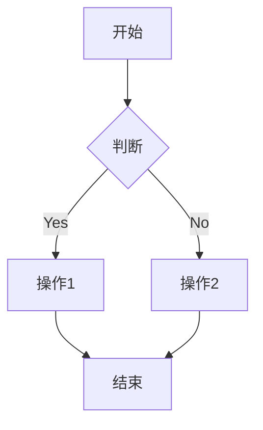

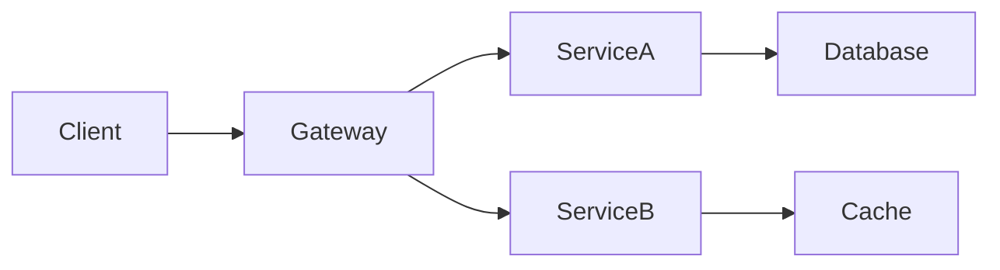

### 时序图

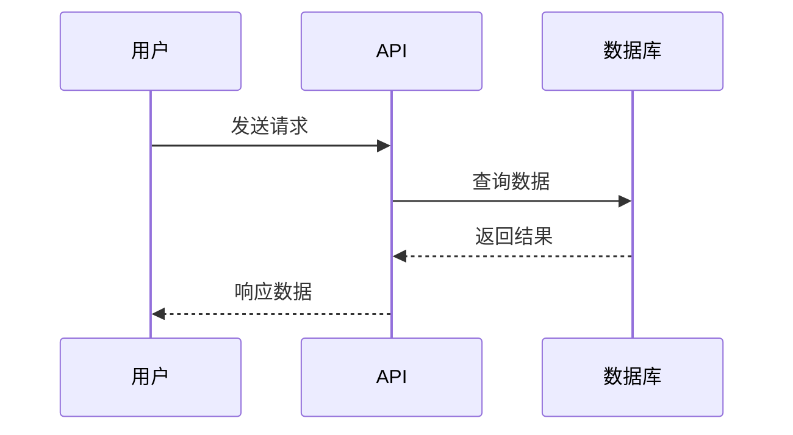

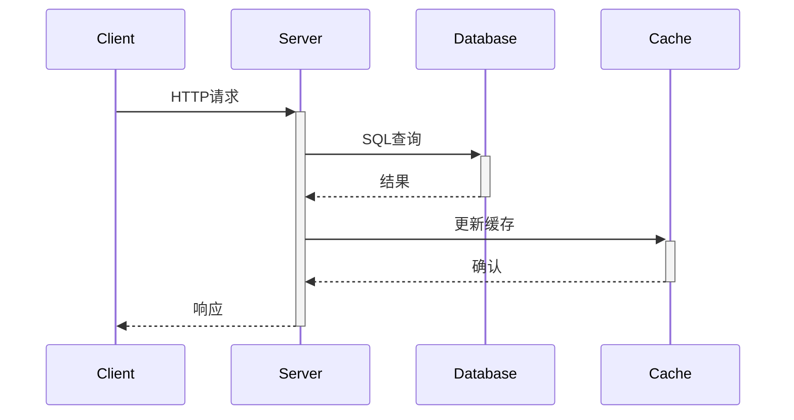

### 类图

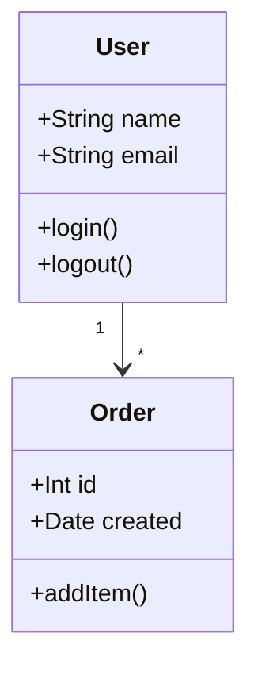

### ER图（实体关系）

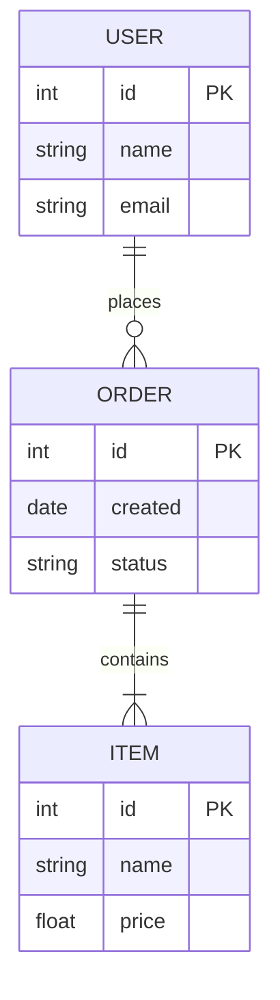

### 状态图

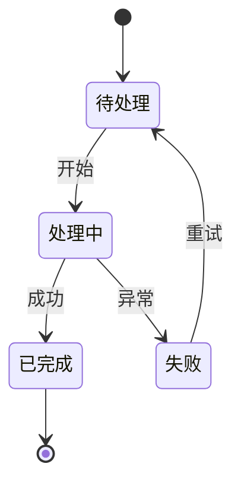

### 甘特图

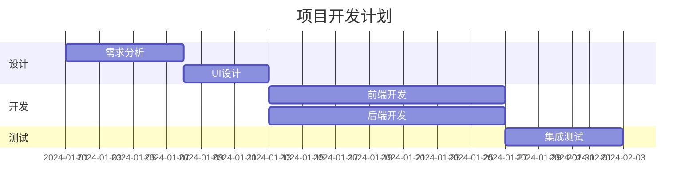

## 常见架构模式

### 微服务架构

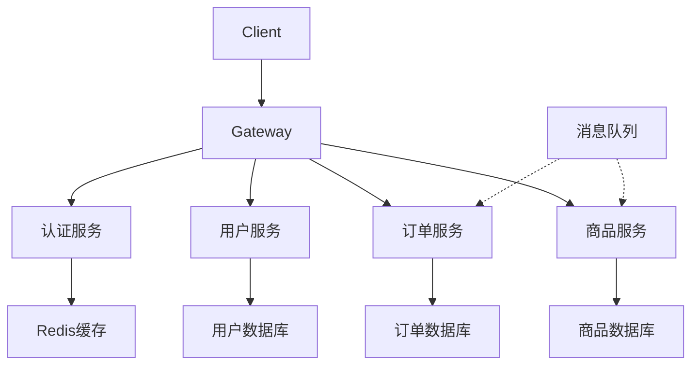

### 前端架构

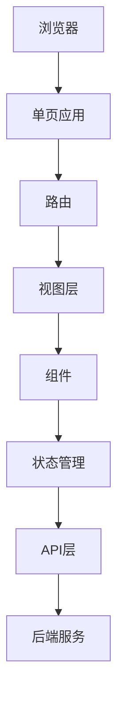

### 数据流架构

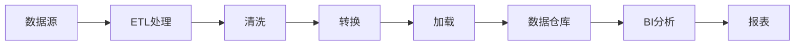

## 图表最佳实践

### 布局方向

```
TD/TB - 从上到下（默认）
LR - 从左到右
RL - 从右到左
BT - 从下到上
```

### 连接样式

```
--> 实线箭头
--- 实线无箭头
-.- 虚线箭头
-.- 虚线无箭头
==> 加粗箭头
-- 文字标注 --
```

### 形状选择

```
[] 矩形（默认）
() 圆角矩形
((())) 圆形
{} 菱形（判断）
{{}} 六边形
[/] 平行四边形
```

## 使用场景

| 图表类型 | 适用场景           |
| -------- | ------------------ |
| 流程图   | 业务流程、算法逻辑 |
| 时序图   | API交互、协议流程  |
| 类图     | 面向对象设计       |
| ER图     | 数据库设计         |
| 状态图   | 状态机、生命周期   |
| 甘特图   | 项目计划、时间线   |

## 生成和渲染

### Markdown 内嵌

````markdown

````

````

### HTML 渲染
```html
<script src="https://cdn.jsdelivr.net/npm/mermaid/dist/mermaid.min.js"></script>
<div class="mermaid">
graph TD
    A --> B
</div>
````

### CLI 导出图片

```bash
# 安装
npm install -g @mermaid-js/mermaid-cli

# 导出 PNG
mmdc -i diagram.mmd -o diagram.png

# 导出 SVG
mmdc -i diagram.mmd -o diagram.svg -b white
```

### Python 调用

```python
import subprocess

def render_mermaid(code: str, output: str, format: str = 'png'):
    """渲染 Mermaid 图表"""
    with open('temp.mmd', 'w') as f:
        f.write(code)

    subprocess.run([
        'mmdc',
        '-i', 'temp.mmd',
        '-o', output,
        '-f', format
    ])
```
