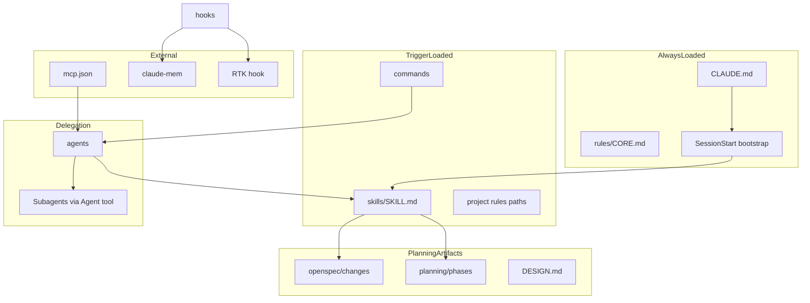
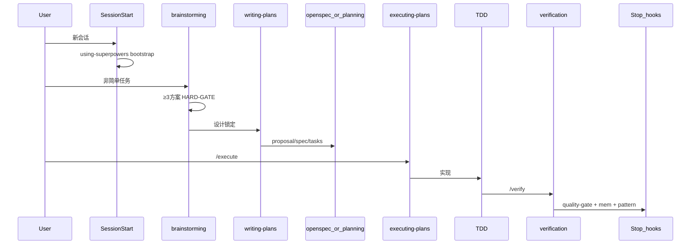
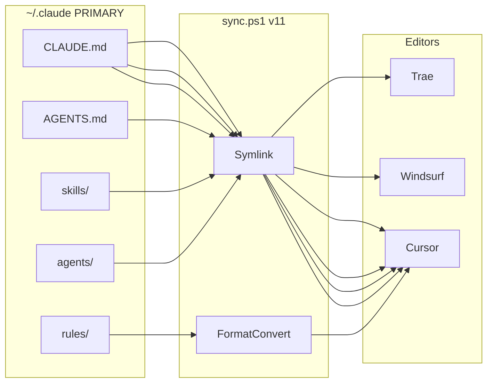

# Design — .claude 配置整合架构

> **设计源优先级**：21 个 GitHub 仓库 PRIMARY → 本地 `~/.claude` 仅迁移对照  
> **关联**：[spec.md](./spec.md) | [tasks.md](./tasks.md)

---

## 1. 设计目标

构建一套 **Claude Code 主环境 + 多编辑器同步** 的全局配置体系：

- 非简单任务有强制工作流（superpowers）
- 规格制品可追踪（OpenSpec + GSD-redux 混合）
- 跨会话可持续学习（claude-mem + experiences）
- Token 成本可控（RTK + caveman 双轨）
- UI 项目有设计 token 标准（awesome-design-md）
- 无左右手互博（MANIFEST 唯一归属）

---

## 2. 各类型 PRIMARY 骨架（一表看清）

| 类型 | PRIMARY 仓库 | 骨架形态 | 全局上限 | 项目级扩展 |
|------|-------------|----------|----------|------------|
| **入口** | best-practice + karpathy | CLAUDE.md 路由 ≤200 行 | 1 文件 | 项目 CLAUDE.md |
| **索引** | ECC | SPEC.md + MANIFEST.yaml | 2 文件 | — |
| **Rules** | ECC + karpathy | rules/CORE 等 8 文件 alwaysApply | 8 | `.claude/rules/` lazy-load |
| **Skills 格式** | anthropics/skills | SKILL.md + frontmatter + references/ | ≤20 global | domain skills 项目内 |
| **Workflow** | superpowers | 13 skill 链 + HARD-GATE | 13 | — |
| **Agents** | ECC + superpowers | 薄编排 .md + skills 预加载 | ≤15 | language reviewer 项目内 |
| **Commands** | superpowers + OpenSpec | slash → pointer skill/agent | ~10 | 项目 commands/ |
| **Hooks** | superpowers + ECC + RTK | profile-based 生命周期 | 8 核心 | 不同步编辑器 |
| **MCP** | github-mcp-server + ECC | .mcp.json 权威 + mcp-configs/ | 分组 3 片 | 项目 .mcp.json |
| **Memory** | claude-mem | plugin + 6 hooks + DB | 1 plugin | — |
| **Spec 变更** | OpenSpec | openspec/changes/ | 模板 | 项目根 |
| **Spec 阶段** | GSD-redux | .planning/phases/ | 模板 | 项目根 |
| **Spec 轻量** | OpenSpec + 本地 | spec/project/ 三件套 | 模板 | ~/.claude/spec/ |
| **Design** | awesome-design-md | DESIGN.md YAML | 模板 | 项目根 |
| **Token** | RTK + caveman | hook + skill 双轨 | 各 1 | — |
| **持续学习** | claude-mem + ECC | experiences/{patterns,instincts}/ | 目录 | — |
| **同步** | caveman 单源 | sync.ps1 软链接 | 脚本 | 不同步 hooks/mcp |
| **CI** | claude-code-action | templates/github-actions/ | 模板 | 项目 .github/ |

---

## 3. PRIMARY 骨架公式

```
PRIMARY RUNTIME
  = superpowers      (workflow engine)
  + ECC              (structure, cherry-pick only)
  + anthropics/skills (format authority)
  + best-practice    (config conventions)
  + claude-mem       (memory layer)

PROJECT ARTIFACTS
  = OpenSpec         (openspec/changes/)
  + GSD-redux        (.planning/phases/)
  + spec/            (轻量三件套，小功能)
  + optional task-master (.taskmaster/)

OPTIMIZATION
  = RTK              (shell output compression)
  + caveman          (agent output compression)

DESIGN (UI projects)
  = awesome-design-md (DESIGN.md YAML)
  + ui-ux-pro-max     (search skill)

REFERENCE ONLY (不并入 runtime)
  = x1xhlol, 30-seconds-of-code, awesome-claude-code, deer-flow, gsd-build原仓库
```

---

## 4. 目标目录树

### 4.1 全局 `~/.claude/`

```
~/.claude/
├── CLAUDE.md                 # 路由层 ≤200行
├── AGENTS.md                  # sync 生成，跨编辑器 autodiscovery
├── SPEC.md                    # 索引法典（组件在哪、归属谁、来源哪）
├── MANIFEST.yaml              # concern → owner 唯一映射
├── agent.yaml                 # ECC harness manifest
├── SYNC_GUIDE.md
├── settings.json
├── .mcp.json
│
├── rules/                     # ≤8 alwaysApply
│   ├── CORE.md                # R1-R11 + Karpathy 四原则
│   ├── SECURITY.md            # OWASP + AgentShield (ECC)
│   ├── GIT.md
│   ├── WORKFLOW.md            # discuss→plan→execute→verify→ship
│   ├── AGENTS.md              # 归属矩阵 + 互斥规则
│   ├── MCP.md
│   ├── DESIGN.md              # DESIGN.md 使用规范（非 token 本身）
│   └── README.md
│
├── skills/                    # ≤20 全局（13 workflow + ≤7 meta/domain-bridge）
│   ├── [superpowers ×13]      # using-superpowers … finishing-a-development-branch, writing-skills
│   ├── memory-compression/    # claude-mem 互补
│   ├── karpathy-guidelines/   # karpathy-skills
│   ├── caveman-compress/      # caveman
│   ├── spec-validation/       # OpenSpec 审查
│   └── ui-ux-pro-max/         # optional
│
├── agents/                    # ≤15 薄编排
│   ├── planner.md
│   ├── code-explorer.md
│   ├── code-reviewer.md
│   ├── build-error-resolver.md
│   ├── architect.md
│   ├── spec-reviewer.md
│   ├── context-manager.md
│   └── agentic-orchestrator.md  # 仅多 Agent 并行
│
├── commands/
│   ├── discuss.md / plan.md / execute.md / verify.md / ship.md
│   ├── propose.md / apply.md / archive.md
│   └── compact.md
│
├── hooks/                     # Claude Code 专用，不同步
│   ├── hooks.json
│   ├── session-start-bootstrap.*
│   ├── pre-rtk-rewrite.*
│   ├── pre-bash-guard.* / pre-prompt-guard.*
│   ├── post-secret-detector.*
│   ├── stop-quality-gate.* / stop-pattern-extraction.*
│   └── _editor_hook_launcher.*
│
├── mcp-configs/
│   ├── core.json / dev.json / ops.json
│
├── templates/
│   ├── openspec/              # OpenSpec
│   ├── planning/              # GSD-redux
│   ├── spec/                  # 轻量三件套
│   ├── DESIGN.md              # awesome-design-md
│   └── github-actions/
│
├── experiences/
│   ├── patterns/ / instincts/ / rejected/
│
├── plugins/                   # claude-mem marketplace
├── scripts/
│   ├── sync.ps1 / sync.sh
│   ├── validate_config.py
│   └── migrate-from-legacy.py
│
└── spec/claude-config-integration/
    ├── design.md / spec.md / tasks.md
```

### 4.2 项目级 `<repo>/`

```
<repo>/
├── CLAUDE.md                  # 项目路由：架构 + 构建命令
├── DESIGN.md                  # UI token YAML (awesome-design-md)
├── openspec/                  # 功能变更 (OpenSpec)
├── .planning/                 # 大功能阶段 (GSD-redux)
├── .taskmaster/               # 可选 backlog
├── .claude/
│   ├── rules/                 # paths: lazy-load
│   └── skills/                # domain skills
└── docs/superpowers/specs/    # brainstorming 产出
```

---

## 5. Tool-First 调用链（最大化已有能力）

```
收到任务
  1. 查 MANIFEST.yaml → 确定 owner（skill/agent/hook）
  2. 触发 P0 skill（brainstorming / verification / debugging / using-superpowers）
  3. 必要时委派 agent（薄编排，预加载 skill）
  4. hooks 自动守卫（不重做 skill 决策）
  5. MCP 按 TOOL_MATCHING_GUIDE 语义匹配（自然语言 → 工具）
  6. 项目 domain skill / lazy rules 最后加载
```

**编辑器侧**：hooks/commands/MCP 不同步时，依赖 CLAUDE.md 指针 + skills/agents + TOOL_MATCHING_GUIDE 自然语言匹配。

---

## 6. 组件关系



---

## 7. 加载优先级链

```
用户显式指令
  > CLAUDE.md 路由指针
  > 当前激活 skill（含 P0 强制 skill）
  > 项目 lazy rules (paths: frontmatter)
  > 全局 alwaysApply rules
  > Default system prompt

SessionStart（会话初始化，非请求级）：
  > using-superpowers bootstrap → 注入 skill 发现规则
```

---

## 8. Single Source of Truth

| 内容类型 | 唯一所有者 | 其他地方只能 |
|----------|------------|--------------|
| 铁律 R1-R11 + Karpathy | rules/CORE.md | pointer |
| Workflow 步骤 | skills/*/SKILL.md | agents 写 `skills: [name]` |
| Subagent persona | agents/*.md | skills 不重复 agent 指令 |
| UI token | DESIGN.md | frontend skill 引用路径 |
| 功能变更 spec | openspec/changes/ | CLAUDE.md 不抄需求 |
| 大功能阶段 spec | .planning/phases/*-SPEC.md | 不与 openspec 同功能 |
| 小功能 spec | spec/project/spec.md | 不与 openspec 同功能 |
| MCP 定义 | .mcp.json + mcp-configs/ | skills 不写 server 定义 |
| 跨会话记忆 | claude-mem DB | skills 不写历史正文 |
| 触发词 | skill description | rules 不写 trigger 列表 |

---

## 9. 防左右手互博矩阵

| Concern | Owner | Delegates | Excludes |
|---------|-------|-----------|----------|
| 头脑风暴 | skill/brainstorming | — | agent/planner |
| 写计划 | skill/writing-plans | agent/planner | orchestrator |
| 多 Agent 并行 | agent/agentic-orchestrator | skill/subagent-driven-development | planner |
| 请求审查 | skill/requesting-code-review | — | reviewer 改代码 |
| 接收审查 | skill/receiving-code-review | agent/code-reviewer | — |
| TDD | skill/test-driven-development | — | rules 重复流程 |
| 调试 | skill/systematic-debugging | — | — |
| 完成验证 | skill/verification-before-completion | hook/stop-quality-gate | — |
| Spec 审查 | skill/spec-validation | agent/spec-reviewer | — |
| 跨会话记忆 | claude-mem plugin | skill/memory-compression | context-manager 仅检索 |
| 上下文腐败 | skill/memory-compression | hook/pre-compact-state | 多处重复阈值 |
| Shell 压缩 | hook/pre-rtk-rewrite | — | skill 重复 |
| 输出压缩 | skill/caveman-compress | — | hook 重复 |
| 变更规格 | openspec/changes/ | command/propose | .planning 同功能 |
| 阶段规划 | .planning/phases/ | GSD workflow guards | openspec 同功能 |
| UI 设计 token | DESIGN.md | skill/ui-ux-pro-max | rules/DESIGN 正文 |
| UI 实现 | 项目 domain skill | agent/ux-design-expert（项目级） | 全局 agents |

**7 条互斥规则**：
1. 一个 workflow 只在一个 skill
2. agents 不嵌 agents（用 Agent 工具）
3. OpenSpec / GSD / TaskMaster 同功能只选一套主导
4. 全局 skill = workflow；domain skill = 项目 `.claude/skills/`
5. hooks 不做决策，只做守卫/注入/持久化
6. bootstrap 唯一：仅 SessionStart → using-superpowers
7. CLAUDE.md ≤200 行

---

## 10. 工作流串联



---

## 11. 规格三轨边界

| 轨道 | 路径 | 适用场景 | 主导命令 |
|------|------|----------|----------|
| OpenSpec | `openspec/changes/<id>/` | 功能变更、brownfield | /propose /apply /archive |
| GSD-redux | `.planning/phases/XX-*/` | 大功能多阶段、里程碑 | /plan + gsd workflow |
| 轻量 spec | `spec/<project>/` | ≤3 文件小功能 | /plan |

**互斥**：同一功能 ID 不可同时存在于两轨。

---

## 12. Token 优化双轨

| 层 | 来源 | 机制 | 压缩对象 |
|----|------|------|----------|
| Shell | RTK | PreToolUse 重写 bash | git status, npm test 等 |
| Agent | caveman | skill + SessionStart lite | 长输出、CLAUDE.md 膨胀 |

正交互补，不重复。RTK 未安装 → hook passthrough。

---

## 13. 持续学习闭环

```
任务完成
  → stop-pattern-extraction → experiences/patterns/ (0.7–0.9)
  → claude-mem 压缩观察 → SQLite+Chroma
  → stop-quality-gate → 阻断未验证完成

置信度 ≥0.9 → experiences/instincts/ → 候选固化 rules/skill
置信度 <0.5 → experiences/rejected/

用户 /compact → pre-compact-state 保存 → memory MCP
新会话 → session-start-bootstrap → 恢复记忆 + caveman lite
```

---

## 14. 同步架构



**同步（用户要求）**：CLAUDE.md, skills/, agents/, rules/  
**派生同步**：AGENTS.md（Cursor autodiscovery 镜像，由 sync 从 CLAUDE.md 生成）  
**不同步**：hooks/, commands/, .mcp.json, settings.json, plugins/

---

## 15. 21 仓库完整映射（全覆盖）

| # | 仓库 | 设计角色 | 落地位置 | 层级 |
|---|------|----------|----------|------|
| 1 | superpowers | Workflow PRIMARY | skills/ + hooks/session-start | P0 |
| 2 | ECC | Structure PRIMARY | agent.yaml, mcp-configs/, placement | P0 |
| 3 | anthropics/skills | Format PRIMARY | skills/writing-skills/, template | P0 |
| 4 | best-practice | Config PRIMARY | rules lazy-load, settings | P0 |
| 5 | claude-mem | Memory PRIMARY | plugins/, memory-compression | P0 |
| 6 | OpenSpec | Change spec | templates/openspec/, commands | P0 |
| 7 | karpathy-skills | Coding philosophy | skills/karpathy-guidelines/ | P0 |
| 8 | RTK | Shell token | hooks/pre-rtk-rewrite | P0 |
| 9 | caveman | Output token + 单源分发 | skills/caveman-compress, sync.ps1 | P0 |
| 10 | github-mcp-server | GitHub MCP | .mcp.json gh | P0 |
| 11 | GSD-redux | Phase planning | templates/planning/ | P1 |
| 12 | awesome-design-md | UI token | templates/DESIGN.md | P1 |
| 13 | ui-ux-pro-max | Design intelligence | skills/ui-ux-pro-max/ | P1 |
| 14 | claude-task-master | Backlog optional | templates/taskmaster/ | P1 |
| 15 | claude-context | Code search MCP | mcp-configs/dev.json optional | P1 |
| 16 | claude-code-action | CI | templates/github-actions/ | P1 |
| 17 | ComposioHQ/awesome-claude-skills | Skill catalog | SPEC.md 索引 | P1 |
| 18 | shanraisshan/best-practice | 编排模式 | commands/ README | P1 |
| 19 | x1xhlol/system-prompts | 竞品参考 | SPEC.md 禁止 copy | P2 |
| 20 | hesreallyhim/awesome-claude-code | 发现索引 | SPEC.md catalog | P2 |
| 21 | 30-seconds-of-code | 30秒约束 | skills/README 原则 | P2 |
| — | gsd-build/get-shit-done | 废弃 | 仅用 GSD-redux 概念 | — |
| — | deer-flow | 独立平台 | SPEC.md 注明非 IDE 栈 | P2 |

**anthropics/skills 附加优点**（不全局导入，按需项目安装）：docx/pdf/pptx/xlsx document skills → SPEC.md catalog + 项目 `.claude/skills/`。

---

## 16. 本地配置对照策略（非 PRIMARY）

| 本地现有 | 数量 | 设计处置 |
|----------|------|----------|
| skills/ | 120 | workflow 类 deprecated；domain 类 → 项目级 |
| agents/ | 56 | 保留 ≤15 + language reviewer |
| hooks/ | 50 | 合并 8 核心 + ECC_HOOK_PROFILE |
| rules/ | 22 | 合并 8 alwaysApply；语言规则 lazy 到项目 |
| CLAUDE.md | 462 行 | 重写为 ≤200 行路由层 |
| sync.ps1 | v10 | 升级 v11 + CLAUDE.md 软链接 |

有效 legacy patterns → `experiences/patterns/`，重复项 → `experiences/rejected/`。

---

## 17. 关键设计决策记录

| ID | 决策 | 理由 | 来源 |
|----|------|------|------|
| D-01 | 仓库 PRIMARY，本地对照 | 用户明确要求 | — |
| D-02 | superpowers 为 workflow 唯一引擎 | eval 验证、HARD-GATE | superpowers |
| D-03 | ECC cherry-pick 非整包 | 232 skills 导致 context rot | ECC |
| D-04 | 规格三轨混合 | 用户确认 OpenSpec + GSD + 轻量 | OpenSpec, GSD-redux |
| D-05 | RTK + caveman 双轨 | 用户确认，正交互补 | RTK, caveman |
| D-06 | CLAUDE.md ≤200 行 | best-practice 实证 | best-practice |
| D-07 | hooks 不同步到编辑器 | 防循环冲突 | 本地 SYNC_GUIDE 经验 |
| D-08 | GSD 原仓库废弃 | rug-pull 风险 | 社区公告 |

---

| D-09 | P0 强制 skill 仅 4 个 | 控制 token；其余按需触发 | superpowers + 本地 |
| D-10 | domain skill 不全局堆叠 | 120 legacy 降级项目级 | ECC placement |
| D-11 | legacy 有效 patterns 保留 | 零优点丢失 | 本地 experiences |

---

## 18. 需求符合性自检

| 用户要求 | 设计对应 | 状态 |
|----------|----------|------|
| 21 仓库 PRIMARY | §15 完整映射 | ✓ |
| 每类型主要骨架 | §2 骨架表 | ✓ |
| 本地仅参考 | §16 对照策略 | ✓ |
| 软链接同步 CLAUDE+skills+agents+rules | §14 同步架构 | ✓ |
| Claude Code + 编辑器可用 | §5 Tool-First + §14 | ✓ |
| 不过度优化保留优点 | §16 legacy patterns | ✓ |
| 持续学习 | §13 闭环 | ✓ |
| 上下文管理 | §9 上下文腐败 owner | ✓ |
| 非简单任务有计划 | §10 工作流 + §11 三轨 | ✓ |
| 最大化已有工具 | §5 Tool-First | ✓ |
| 无左右手互博 | §9 MANIFEST | ✓ |
| 言简意赅 | CLAUDE≤200 + 30秒 skill | ✓ |

---

_版本：1.1 | 日期：2026-05-22 | 审查修订_
