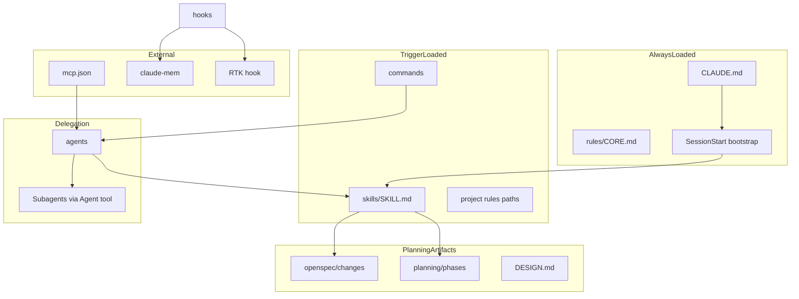
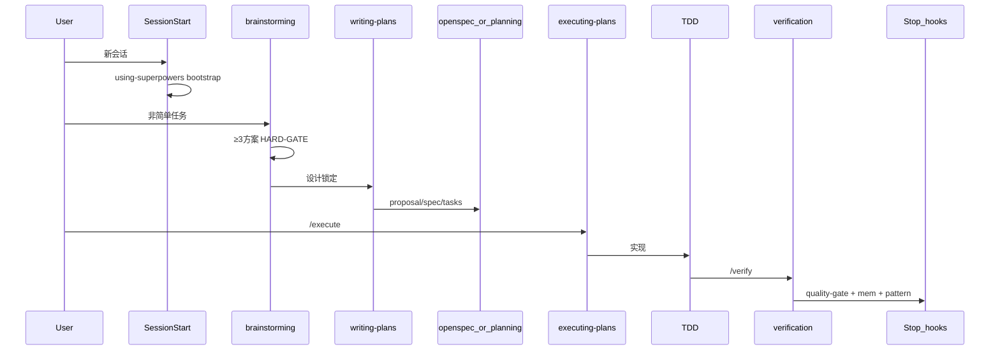
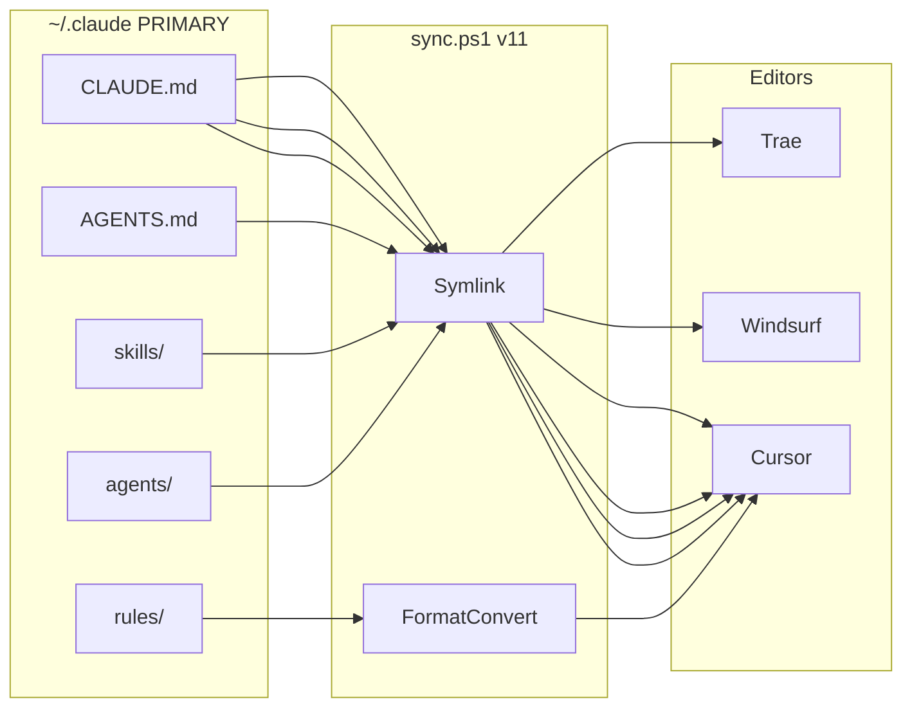

# Design — .claude 配置整合架构

> **设计源优先级**：22 个 GitHub 仓库 PRIMARY → 本地 `~/.claude` 仅迁移对照  
> **版本**：2.3 | **关联**：[spec.md](./spec.md) | [tasks.md](./tasks.md)

---

## 1. 设计目标

构建 **Claude Code 主环境 + 多编辑器软链接同步** 的全局配置：

- **五柱骨架**清晰：方法论 / 上下文 / 规格 / 审查 / 记忆 各一 owner
- 非简单任务：brainstorming → writing-plans → execute → verify（superpowers）
- 规格三轨互斥：OpenSpec / GSD / 轻量 spec
- 跨会话学习：claude-mem + experiences + instinct-learning
- Token 双轨：RTK（shell）+ caveman（回复）
- 无左右手互博：MANIFEST.yaml 唯一归属

---

## 2. 五柱架构（主骨架）

| 柱 | PRIMARY | 职责 | Owner 类型 | 禁止替代 |
|----|---------|------|------------|----------|
| **Superpowers** | obra/superpowers | 方法论 + 13 workflow + P0×4 + HARD-GATE | skills/ | hook 做 workflow 决策 |
| **GSD** | GSD-redux 概念 | 上下文工程：<40%/50%/70%、read-before-edit、连续执行 | rules/CONTEXT + skill/context-engineering | 多处重复阈值 |
| **OpenSpec** | Fission-AI/OpenSpec | 变更规格 proposal→spec→tasks | openspec/changes/ + spec-validation | .planning 同功能 |
| **gstack** | garrytan/gstack | 角色审查 + 发布/产品/设计补全 | agents/ ×12 + skill/autoplan,ship | superpowers 审查 skill 重复 |
| **claude-mem** | thedotmack/claude-mem | 跨会话记忆 SSOT + 6 lifecycle hooks | plugin/ | memory MCP 作 SSOT |

**gstack 定位**：执行层角色路由，**非**方法论主骨架（见 reference/desktop-code-prototype）。

### 2.1 辅助层（非柱，但必需）

| 层 | PRIMARY | 职责 | 全局上限 |
|----|---------|------|----------|
| 结构 | ECC | MANIFEST、agent.yaml、catalog、hook profile | catalog 按需 |
| 格式 | anthropics/skills | SKILL.md frontmatter + writing-skills | 格式权威 |
| 入口 | best-practice + karpathy | CLAUDE.md 路由 | ≤500 行（当前 ~165） |
| 优化 | RTK + caveman | Token 双轨 | hook + skill 各 1 |
| 设计 | awesome-design-md | DESIGN.md YAML | 模板 + catalog/ui-ux-pro-max |
| 同步 | 本地 sync.ps1 v11 | CLAUDE+skills+agents+rules 软链 | 脚本 |
| 工程补强 | mattpocock/skills | diagnose/grill/handoff 等 | **catalog 按需**，不全局堆叠 |

### 2.2 规模约束（v2.2 实测）

| 类型 | 上限 | 当前 | 组成 |
|------|------|------|------|
| 全局 skills | ≤25 | 25 | superpowers 13 + 扩展 8 + meta 4 |
| 全局 agents | ≤22 | 20 | core 8 + gstack 审查 5 + gstack 补全 7 |
| 全局 rules | 10 | 9 | CORE/BESTPRACTICE/SECURITY/GIT/WORKFLOW/AGENTS/MCP/DESIGN/CONTEXT |
| catalog/skills | — | 100 | ComposioHQ + anthropics + mattpocock 等 |
| catalog/agents | — | 43 | 语言 reviewer + 领域 |

---

## 3. PRIMARY 骨架公式

```
五柱 RUNTIME
  = superpowers     (workflow + P0 + HARD-GATE)
  + GSD-redux       (context thresholds + read-before-edit + subagent fresh context)
  + OpenSpec        (change spec + spec-validation)
  + gstack          (review routing + ship/autoplan/office-hours agents)
  + claude-mem      (memory SSOT + pattern extraction)

结构层
  = ECC(cherry-pick) + anthropics/skills(format) + best-practice(entry) + karpathy(CORE)

项目制品（三轨互斥）
  = openspec/changes/ | .planning/phases/ | spec/<project>/

优化层
  = RTK(hook) + caveman(skill)

领域扩展
  = catalog/skills + catalog/agents（含 mattpocock 工程 skill 按需复制）

REFERENCE ONLY
  = x1xhlol, hesreallyhim/awesome-claude-code, gsd-build 原仓库, deer-flow 独立平台
```

---

## 4. 目标目录树

### 4.1 全局 `~/.claude/`

```
~/.claude/
├── CLAUDE.md                 # 路由层 ≤500 行（目标 ~165）
├── AGENTS.md                  # sync 生成，跨编辑器 autodiscovery
├── SPEC.md                    # 索引法典（组件在哪、归属谁、来源哪）
├── MANIFEST.yaml              # concern → owner 唯一映射
├── agent.yaml                 # ECC harness manifest
├── SYNC_GUIDE.md
├── settings.json
├── .mcp.json
│
├── rules/                     # 9 文件（2 skeleton + 7 supplement/lazy）
│   ├── CORE.md                # R1-R11 + Karpathy 四原则（alwaysApply）
│   ├── BESTPRACTICE.md        # 综合最佳实践（alwaysApply）
│   ├── SECURITY.md            # OWASP + AgentShield (ECC)
│   ├── GIT.md
│   ├── WORKFLOW.md            # discuss→plan→execute→verify→ship
│   ├── AGENTS.md              # 归属矩阵 + 互斥规则
│   ├── MCP.md
│   ├── DESIGN.md              # DESIGN.md 使用规范（非 token 本身）
│   └── CONTEXT.md             # 上下文工程 + claude-context 启用
│
├── skills/                    # ≤25 全局
│   ├── [superpowers ×13]      # P0×4 在 superpowers 13 内
│   ├── [gstack/GSD/ECC ×8]    # autoplan, ship, office-hours, context-engineering …
│   └── [meta ×4]              # memory-compression, karpathy, caveman, spec-validation
│
├── catalog/skills/            # ~100 领域库（ui-ux-pro-max, mattpocock 等按需）
├── catalog/agents/            # 43 领域库（语言 reviewer 等）
│
├── agents/                    # ≤22（20 当前）
│   ├── [core ×8]              # planner, code-explorer, code-reviewer …
│   ├── [gstack 审查 ×5]       # eng/ceo/designer/qa/security-reviewer
│   └── [gstack 补全 ×7]       # cso, sre, release-engineer, product-manager …
│
├── commands/
│   ├── discuss.md / plan.md / execute.md / verify.md / ship.md
│   ├── propose.md / apply.md / archive.md
│   └── compact.md
│
├── hooks/                     # Claude Code 专用，不同步
│   ├── hooks.json
│   ├── session-start-bootstrap.*
│   ├── pre-rtk-rewrite.*
│   ├── pre-bash-guard.* / pre-prompt-guard.*
│   ├── post-secret-detector.*
│   ├── stop-quality-gate.* / stop-pattern-extraction.*
│   └── _editor_hook_launcher.*
│
├── mcp-configs/
│   ├── core.json / dev.json / ops.json
│
├── templates/
│   ├── openspec/              # OpenSpec
│   ├── planning/              # GSD-redux
│   ├── spec/                  # 轻量三件套
│   ├── taskmaster/            # task-master 轻量模板（optional）
│   ├── DESIGN.md              # awesome-design-md
│   └── github-actions/
│
├── experiences/
│   ├── patterns/ / instincts/ / rejected/
│
├── plugins/                   # claude-mem marketplace
├── scripts/
│   ├── sync.ps1 / sync.sh
│   ├── validate_config.py
│   └── migrate-from-legacy.py
│
└── spec/claude-config-integration/
    ├── design.md / spec.md / tasks.md
```

### 4.2 项目级 `<repo>/`

```
<repo>/
├── CLAUDE.md                  # 项目路由：架构 + 构建命令
├── DESIGN.md                  # UI token YAML (awesome-design-md)
├── openspec/                  # 功能变更 (OpenSpec)
├── .planning/                 # 大功能阶段 (GSD-redux)
├── .taskmaster/               # 可选 backlog
├── .claude/
│   ├── rules/                 # paths: lazy-load
│   └── skills/                # domain skills
└── docs/superpowers/specs/    # brainstorming 产出
```

---

## 5. Tool-First 调用链（最大化已有能力）

```
收到任务
  1. 查 MANIFEST.yaml → 确定 owner（skill/agent/hook）
  2. 触发 P0 skill（brainstorming / verification / debugging / using-superpowers）
  3. 必要时委派 agent（薄编排，预加载 skill）
  4. hooks 自动守卫（不重做 skill 决策）
  5. MCP 按 TOOL_MATCHING_GUIDE 语义匹配（自然语言 → 工具）
  6. 项目 domain skill / lazy rules 最后加载
```

**编辑器侧**：hooks/commands/MCP 不同步时，依赖 CLAUDE.md 指针 + skills/agents + TOOL_MATCHING_GUIDE 自然语言匹配。

---

## 6. 组件关系



---

## 7. 加载优先级链

```
用户显式指令
  > CLAUDE.md 路由指针
  > 当前激活 skill（含 P0 强制 skill）
  > 项目 lazy rules (paths: frontmatter)
  > 全局 alwaysApply rules
  > Default system prompt

SessionStart（会话初始化，非请求级）：
  > using-superpowers bootstrap → 注入 skill 发现规则
```

---

## 8. Single Source of Truth

| 内容类型 | 唯一所有者 | 其他地方只能 |
|----------|------------|--------------|
| 铁律 R1-R11 + Karpathy | rules/CORE.md | pointer |
| Workflow 步骤 | skills/*/SKILL.md | agents 写 `skills: [name]` |
| Subagent persona | agents/*.md | skills 不重复 agent 指令 |
| UI token | DESIGN.md | frontend skill 引用路径 |
| 功能变更 spec | openspec/changes/ | CLAUDE.md 不抄需求 |
| 大功能阶段 spec | .planning/phases/*-SPEC.md | 不与 openspec 同功能 |
| 小功能 spec | spec/project/spec.md | 不与 openspec 同功能 |
| MCP 定义 | .mcp.json + mcp-configs/ | skills 不写 server 定义 |
| 跨会话记忆 | claude-mem DB | skills 不写历史正文 |
| 触发词 | skill description | rules 不写 trigger 列表 |

---

## 9. 防左右手互博矩阵

| Concern | Owner | Delegates | Excludes |
|---------|-------|-----------|----------|
| 头脑风暴 | skill/brainstorming | — | agent/planner |
| 写计划 | skill/writing-plans | agent/planner | orchestrator |
| 多 Agent 并行 | agent/agentic-orchestrator | skill/subagent-driven-development | planner |
| 请求审查 | skill/requesting-code-review | — | reviewer 改代码 |
| 接收审查 | skill/receiving-code-review | agent/code-reviewer | — |
| TDD | skill/test-driven-development | — | rules 重复流程 |
| 调试 | skill/systematic-debugging | — | — |
| 完成验证 | skill/verification-before-completion | hook/stop-quality-gate | — |
| Spec 审查 | skill/spec-validation | agent/spec-reviewer | — |
| 跨会话记忆 | claude-mem plugin | skill/memory-compression | context-manager 仅检索 |
| 上下文腐败 | skill/memory-compression | hook/pre-compact-state | 多处重复阈值 |
| Shell 压缩 | hook/pre-rtk-rewrite | — | skill 重复 |
| 输出压缩 | skill/caveman-compress | — | hook 重复 |
| 变更规格 | openspec/changes/ | command/propose | .planning 同功能 |
| 阶段规划 | .planning/phases/ | GSD workflow guards | openspec 同功能 |
| UI 设计 token | DESIGN.md | catalog/skills/ui-ux-pro-max | rules/DESIGN 正文 |
| UI 实现 | 项目 domain skill | agent/ux-design-expert（项目级） | 全局 agents |

**7 条互斥规则**：
1. 一个 workflow 只在一个 skill
2. agents 不嵌 agents（用 Agent 工具）
3. OpenSpec / GSD / TaskMaster 同功能只选一套主导
4. 全局 skill = workflow；domain skill = 项目 `.claude/skills/`
5. hooks 不做决策，只做守卫/注入/持久化
6. bootstrap 唯一：仅 SessionStart → using-superpowers
7. CLAUDE.md ≤500 行（目标 ~165）

---

## 10. 工作流串联



---

## 11. 规格三轨边界

| 轨道 | 路径 | 适用场景 | 主导命令 |
|------|------|----------|----------|
| OpenSpec | `openspec/changes/<id>/` | 功能变更、brownfield | /propose /apply /archive |
| GSD-redux | `.planning/phases/XX-*/` | 大功能多阶段、里程碑 | /plan + gsd workflow |
| 轻量 spec | `spec/<project>/` | ≤3 文件小功能 | /plan |

**互斥**：同一功能 ID 不可同时存在于两轨。

---

## 12. Token 优化双轨

| 层 | 来源 | 机制 | 压缩对象 |
|----|------|------|----------|
| Shell | RTK | PreToolUse 重写 bash | git status, npm test 等 |
| Agent | caveman | skill + SessionStart lite | 长输出、CLAUDE.md 膨胀 |

正交互补，不重复。RTK 未安装 → hook passthrough。

---

## 13. 持续学习闭环

```
任务完成
  → stop-pattern-extraction → experiences/patterns/ (0.7–0.9)
  → claude-mem 压缩观察 → SQLite+Chroma
  → stop-quality-gate → 阻断未验证完成

置信度 ≥0.9 → experiences/instincts/ → 候选固化 rules/skill
置信度 <0.5 → experiences/rejected/

用户 /compact → pre-compact-state 保存 → memory MCP
新会话 → session-start-bootstrap → 恢复记忆 + caveman lite
```

---

## 14. 同步架构



**同步（用户要求）**：CLAUDE.md, skills/, agents/, rules/  
**派生同步**：AGENTS.md（Cursor autodiscovery 镜像，由 sync 从 CLAUDE.md 生成）  
**不同步**：hooks/, commands/, .mcp.json, settings.json, plugins/

---

## 15. 22 仓库完整映射

### 15.1 五柱 + P0 基础

| # | 仓库 | 柱/层 | 落地 | 采纳要点 |
|---|------|-------|------|----------|
| 1 | obra/superpowers | 柱① | skills/×13, hooks/session-start | HARD-GATE, P0×4, 13 workflow |
| 2 | GSD-redux | 柱② | rules/CONTEXT, templates/planning/, pre-read-before-edit | <40/50/70%, 连续执行 |
| 3 | Fission-AI/OpenSpec | 柱③ | templates/openspec/, spec-validation | proposal→spec→tasks |
| 4 | garrytan/gstack | 柱④ | agents/×12, skill/autoplan,ship,office-hours | 审查路由, /review |
| 5 | thedotmack/claude-mem | 柱⑤ | plugins/, memory-compression | 6 hooks, SSOT |
| 6 | affaan-m/ECC | 结构 | MANIFEST, agent.yaml, catalog/, instinct-learning | cherry-pick, 非 232 整包 |
| 7 | anthropics/skills | 格式 | writing-skills, catalog/ | frontmatter 权威 |
| 8 | shanraisshan/best-practice | 入口 | CLAUDE.md, rules/BESTPRACTICE, lazy-load | ≤500 行, settings 层级 |
| 9 | forrestchang/andrej-karpathy-skills | 哲学 | karpathy-guidelines, rules/CORE | 四原则 |
| 10 | rtk-ai/rtk | 优化 | pre-rtk-rewrite, RTK.md | shell 压缩 |
| 11 | JuliusBrussee/caveman | 优化 | caveman-compress, sync.ps1 | 回复压缩 + 单源 |

### 15.2 P1 选择性增强

| # | 仓库 | 落地 | 采纳要点 |
|---|------|------|----------|
| 12 | github/github-mcp-server | .mcp.json, mcp-configs/ | gh MCP |
| 13 | anthropics/claude-code-action | templates/github-actions/ | CI review |
| 14 | VoltAgent/awesome-design-md | templates/DESIGN.md, rules/DESIGN | UI token YAML |
| 15 | nextlevelbuilder/ui-ux-pro-max | catalog/skills/ui-ux-pro-max | BM25 设计库 |
| 16 | eyaltoledano/claude-task-master | templates/taskmaster/ | PRD→tasks 轻量模板 |
| 17 | zilliztech/claude-context | mcp-configs/dev.json optional + rules/CONTEXT | 大 monorepo 语义索引 |
| 18 | ComposioHQ/awesome-claude-skills | catalog/skills/ 索引 | 发现，不全局堆 |
| 19 | **mattpocock/skills** | **catalog/ 按需** | 见 §15.4 去重表 |

### 15.3 P2 参考 only

| # | 仓库 | 处理 |
|---|------|------|
| 20 | x1xhlol/system-prompts | → rules/BESTPRACTICE.md 原则；禁止 copy runtime |
| 21 | hesreallyhim/awesome-claude-code | SPEC.md 外链索引 |
| 22 | Chalarangelo/30-seconds-of-code | catalog 片段参考 |
| — | gsd-build/get-shit-done | 废弃；概念已入 GSD-redux |
| — | bytedance/deer-flow | 四阶段编排 → rules/WORKFLOW；非 IDE 栈 |

### 15.4 mattpocock/skills 去重（防互博）

| mattpocock skill | 全局 owner | 处置 |
|------------------|------------|------|
| tdd | skill/test-driven-development | ❌ 不导入；superpowers 覆盖 |
| diagnose | skill/systematic-debugging | catalog 可选；references 可吸收 |
| grill / grill-with-docs | skill/brainstorming + structured-artifacts | catalog；CONTEXT.md 模式入 templates |
| to-prd / to-issues | skill/writing-plans + gh MCP | catalog 按需 |
| zoom-out | agent/code-explorer | 行为已覆盖 |
| handoff | skill/structured-artifacts + claude-mem | catalog 按需 |
| caveman | skill/caveman-compress | ❌ 已有 |
| git-guardrails | hook/pre-bash-guard | 行为已覆盖 |
| setup-matt-pocock-skills | migrate-from-legacy.py | 项目初始化参考 |

**anthropics document skills**（docx/pdf/pptx/xlsx）→ catalog + 项目 `.claude/skills/`，不全局。

**anthropics document skills**（docx/pdf/pptx/xlsx）→ catalog + 项目 `.claude/skills/`，不全局。

### 15.5 22 仓库追溯矩阵（FR × Task × 状态）

| # | 仓库 | FR | Task | 落地 | 状态 |
|---|------|-----|------|------|------|
| 1 | obra/superpowers | FR-02 | T2.1–T2.3 | skills/×13, hooks | ✅ |
| 2 | GSD-redux | FR-16 | T3.2, T4.8 | rules/CONTEXT, templates/planning | ✅ |
| 3 | Fission-AI/OpenSpec | FR-03 | T3.1, T3.4 | templates/openspec/ | ✅ |
| 4 | garrytan/gstack | FR-02.9 | T4.5 | agents/×12, autoplan/ship | ✅ |
| 5 | thedotmack/claude-mem | FR-05 | T4.1–T4.2 | plugins/ | ✅ |
| 6 | affaan-m/ECC | FR-01, FR-09 | T1.2–T1.3 | MANIFEST, catalog | ✅ |
| 7 | anthropics/skills | FR-08 | T2.5 | writing-skills, catalog | ✅ |
| 8 | shanraisshan/best-practice | FR-10 | T1.4, T6.2 | CLAUDE.md, BESTPRACTICE | ✅ |
| 9 | forrestchang/andrej-karpathy-skills | FR-07 | T2.4 | karpathy-guidelines | ✅ |
| 10 | rtk-ai/rtk | FR-04 | T4.3 | pre-rtk-rewrite | ✅ |
| 11 | JuliusBrussee/caveman | FR-04 | T4.4, T6.1 | caveman-compress, sync | ✅ |
| 12 | github/github-mcp-server | FR-11 | T4.6 | .mcp.json | ✅ |
| 13 | anthropics/claude-code-action | FR-13 | T5.4 | templates/github-actions | ✅ |
| 14 | VoltAgent/awesome-design-md | FR-06 | T5.1–T5.2 | templates/DESIGN.md | ✅ |
| 15 | nextlevelbuilder/ui-ux-pro-max | FR-06.3 | T5.3 | catalog/ui-ux-pro-max | ✅ |
| 16 | eyaltoledano/claude-task-master | FR-03.7 | T8.5 | templates/taskmaster/ | ✅ |
| 17 | zilliztech/claude-context | FR-11.2 | T8.6 | mcp-configs optional | ✅ |
| 18 | ComposioHQ/awesome-claude-skills | FR-01.8 | T6.8 | catalog 索引 | ✅ |
| 19 | mattpocock/skills | FR-17 | T8.3–T8.4 | catalog×3 | ✅ |
| 20 | x1xhlol/system-prompts | — | T6.8 | BESTPRACTICE 原则 | ✅ 参考 |
| 21 | hesreallyhim/awesome-claude-code | — | T6.8 | SPEC 外链 | ✅ 参考 |
| 22 | Chalarangelo/30-seconds-of-code | — | T6.8 | catalog 片段 | ✅ 参考 |
| — | gsd-build/get-shit-done | — | — | GSD-redux 概念 | ✅ 废弃 clone |
| — | bytedance/deer-flow | — | T1.6 | WORKFLOW 四阶段 | ✅ 参考 |

---

## 16. 本地配置对照策略（v2.3 实测）

| 组件 | 迁移前 | 当前 | 处置 |
|------|--------|------|------|
| skills/ 全局 | ~120 | 25 | superpowers 13 + 扩展 8 + meta 4 |
| skills/ catalog | — | ~100 | 领域 + mattpocock 按需 |
| agents/ 全局 | ~56 | 20 | core 8 + gstack 12 |
| hooks/ | ~50 | 24 .py | 8 核心 + profile |
| rules/ | ~22 | 9 | skeleton 2 + supplement lazy |
| CLAUDE.md | 462 行 | ~165 行 | 路由层 ≤500 |
| sync.ps1 | v10 | v11 | CLAUDE.md 软链接 |

有效 legacy patterns → `experiences/patterns/`，重复项 → `experiences/rejected/`。

---

## 17. 关键设计决策记录

| ID | 决策 | 理由 | 来源 |
|----|------|------|------|
| D-01 | 仓库 PRIMARY，本地对照 | 用户明确要求 | — |
| D-02 | superpowers 为 workflow 唯一引擎 | eval 验证、HARD-GATE | superpowers |
| D-03 | ECC cherry-pick 非整包 | 232 skills 导致 context rot | ECC |
| D-04 | 规格三轨混合 | 用户确认 OpenSpec + GSD + 轻量 | OpenSpec, GSD-redux |
| D-05 | RTK + caveman 双轨 | 用户确认，正交互补 | RTK, caveman |
| D-06 | CLAUDE.md ≤500 行（目标 ~165） | best-practice 实证 + v2.1 实测 | best-practice |
| D-07 | hooks 不同步到编辑器 | 防循环冲突 | 本地 SYNC_GUIDE 经验 |
| D-08 | GSD 原仓库废弃 | rug-pull 风险 | 社区公告 |

---

| D-09 | P0 强制 skill 仅 4 个 | 控制 token；其余按需触发 | superpowers + 本地 |
| D-10 | domain skill 不全局堆叠 | catalog 97 + 项目级 | ECC placement |
| D-11 | legacy 有效 patterns 保留 | 零优点丢失 | experiences/ |
| D-12 | 五柱为骨架，gstack 为执行层 | 非 gstack 主方法论 | desktop prototype |
| D-13 | mattpocock catalog 按需 | 与 superpowers 去重 | mattpocock/skills |
| D-14 | 全局 skills≤25 agents≤22 | v2.1 实测通过 validate | 本地 |
| D-15 | task-master 仅模板不全局 skill | writing-plans 已覆盖 | claude-task-master |
| D-16 | claude-context optional MCP | 大 monorepo 按需启用 | zilliztech/claude-context |

---

## 18. 需求符合性自检

| 用户要求 | 设计对应 | 状态 |
|----------|----------|------|
| 22 仓库 PRIMARY | §15 + §15.5 追溯矩阵 | ✓ |
| 五柱骨架清晰 | §2 五柱表 | ✓ |
| 每类型主要骨架 | §2.1 辅助层 | ✓ |
| 本地仅参考 | §16 对照策略 | ✓ |
| 软链接同步 CLAUDE+skills+agents+rules | §14 | ✓ |
| Claude Code + 编辑器可用 | §5 + §14 | ✓ |
| 保留全部优点 | catalog + experiences | ✓ |
| 持续学习 | §13 | ✓ |
| 上下文管理 | GSD 柱 + §9 | ✓ |
| 非简单任务有计划 | §10 + §11 | ✓ |
| Tool-First 最大化 | §5 | ✓ |
| 无左右手互博 | §9 + §15.4 | ✓ |
| 言简意赅 | CLAUDE≤500 + caveman | ✓ |
| FR-17 mattpocock catalog | §15.4 + catalog/×3 | ✓ |
| FR-03.7 task-master 模板 | templates/taskmaster/ | ✓ |
| FR-11.2 claude-context MCP | mcp-configs optional | ✓ |

---

_版本：2.3 | 日期：2026-05-25 | 追溯矩阵 + Phase 8 缺口补齐_
