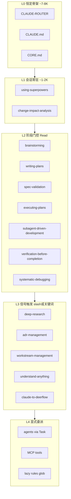
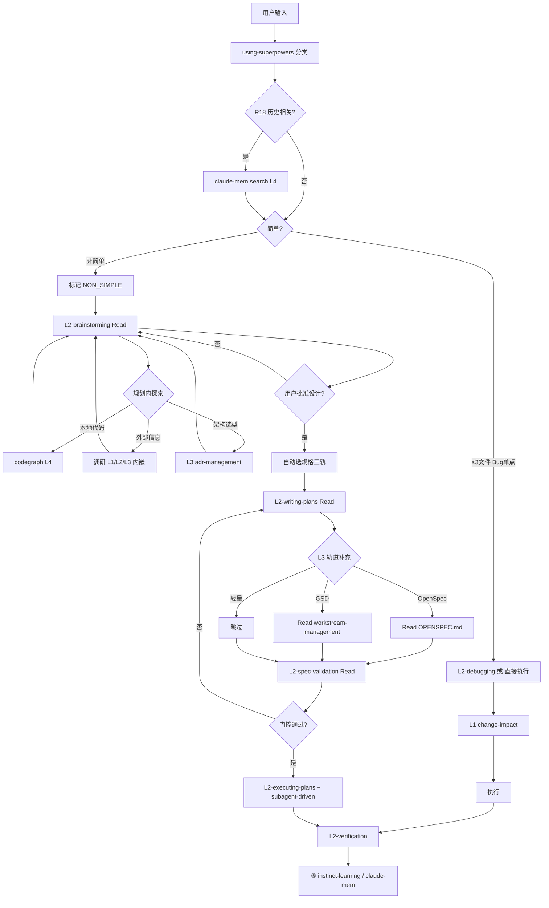
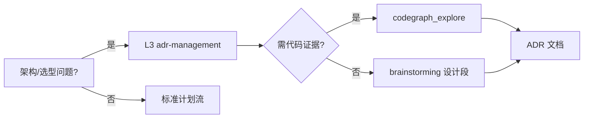

# 配置优化计划 v9.1 — Token 减负 + 分级加载

> **v9.2 补全**：MCP 分层、CORE 去重、V15 校验、RUNTIME_PLAYBOOK → 见 [SPEC.md](../../SPEC.md) v9.2 摘要  
> 状态：已执行 + v9.2 补全 | 日期：2026-06-11 | 前置：[design-v9.md](./design-v9.md)

---

## 决策树 Q&A（已全部对齐）

### 第一轮：Token 减负

| # | 问题 | 决策 | 推荐理由 |
|---|------|------|----------|
| 1 | compound-engineering 插件 | **禁用** | 与本地 gstack agents 重叠；省 ~10–13K/turn |
| 2 | CORE 瘦身 | **五柱×五阶段×三横切×铁律保留**；其余 CLAUDE↔CORE 去重 | 骨架不可删，只消重复段落 |
| 3 | User Rules (~4.6K) | **迁 skills** | git-workflow / pr-workflow / claude-mem-maintenance |
| 4 | MCP 分层 | **core 常驻 + ops 按需** | codegraph+crawl+exa+ctx7+gh+fs 常驻 |
| 5 | 非 P0 skills | **disable-model-invocation** | 29 个 supplement 仅 slash/显式 Read |
| 6 | 同步 | **维持 index 模式** | plugins/MCP/hooks 不同步 |

### 第二轮：分级加载

| # | 问题 | 决策 | 推荐理由 |
|---|------|------|----------|
| 7 | P0 加载 | **混合 C**：`using-superpowers` + `change-impact-analysis` 常驻；brainstorming / verification / debugging **阶段门控** | 应用必用时智能触发，省 ~2–4K；修改类任务 change-impact 必须可达 |
| 8 | 调研分级 | **三档** L1/L2/L3 | 避免凡调研都走 /deep-research |
| 9 | 计划/架构 bundle | **最小 A**：brainstorming → 批准 → writing-plans + spec-validation | 本地代码 **codegraph 优先**；WORKFLOW/OPENSPEC 按需 Read |
| 10 | 智能触发原则 | **1% 可能适用 → Read skill**；阶段进入 → 强制 Read 该阶段 skill | using-superpowers 路由表为 SSOT |

### 第三轮：依赖链闭合（非简单 / 计划 / 调研）

| # | 问题 | 决策 | 推荐理由 |
|---|------|------|----------|
| 11 | 调研时机 | **①规划内嵌** | 批准前完成证据收集，避免 HARD-GATE 通过后才发现信息缺口 |
| 12 | spec-validation 等级 | **L2 仅②门控** | writing-plans 草案后 Read；未通过不得 /execute；④由 verification-before-completion 负责验收 |
| 13 | 规格三轨选型 | **using-superpowers 自动判定** | 减少用户负担；判定后再 L3 Read 对应 rule/skill |

### 第四轮：执行与长任务

| # | 问题 | 决策 | 推荐理由 |
|---|------|------|----------|
| 14 | subagent-driven-development | **非简单一律 L2** | 与 executing-plans 捆绑；子 Agent 隔离上下文（R12） |
| 15 | 长时自主任务 | **deer-flow 仅 L3** | /deer-flow 或 claude-to-deerflow；主会话不预加载编排细节 |

---

## 一、加载等级体系（L0–L4）

中心思想：**骨架恒定、阶段门控、信号触发、显式委派** — 做到「该用时必用，不用时不占上下文」。



| 等级 | 名称 | 内容 | 加载机制 | 预估 tokens |
|------|------|------|----------|-------------|
| **L0** | 骨架 | CLAUDE-ROUTER + CLAUDE.md + CORE.md | alwaysApply / 同步部署 | ~7–8K（去重后） |
| **L1** | 会话常驻 | using-superpowers, change-impact-analysis | description 注入 + 修改信号时 Read 全文 | ~1–2K |
| **L2** | 阶段门控 | 五阶段对应 skill（见下表） | 进入阶段时 **Read SKILL.md 全文**，离开不重复 Read | 按阶段 ~1–3K |
| **L3** | 任务信号 | 调研/架构/并行等 supplement skills | slash、关键词、using-superpowers 路由后 Read | 0 直到触发 |
| **L4** | 显式委派 | agents、MCP、lazy rules | Task 子代理 / 工具调用 / glob 匹配 | 0 直到调用 |

### L1 混合 P0 细则（用户确认 C + 智能触发）

| Skill | 层级 | 加载方式 | 触发信号 |
|-------|------|----------|----------|
| using-superpowers | L1 常驻 | 每会话自动 | 会话开始、不确定用什么 |
| change-impact-analysis | L1 常驻 | 有修改意图时 Read 全文 | 改/删/重构/rename/配置变更 |
| brainstorming | L2 门控 | 进入 ①规划 时 Read | 非简单、方案、架构、新功能、HARD-GATE |
| writing-plans | L2 门控 | brainstorming 批准后 Read | /plan、实施计划、任务分解 |
| spec-validation | L2 门控 | writing-plans 草案完成后 Read | ②→③ 门控；未通过禁止 execute |
| executing-plans | L2 门控 | spec-validation 通过后 Read | /execute |
| subagent-driven-development | L2 门控 | 非简单 + executing-plans 时 Read | 与执行捆绑；简单任务不加载 |
| verification-before-completion | L2 门控 | 进入 ④验证 时 Read | 完成、验收、ship 前 |
| systematic-debugging | L2 门控 | 进入调试路径时 Read | 报错、测试失败、unexpected |

**实现要点** — 双平台分表（解决 Cursor 自动注入 vs Claude Code Read 门控）：

| 平台 | L1（2 个） | L2 门控（3 个原 P0 + 其他 L2） | 其余 supplement |
|------|------------|-------------------------------|-----------------|
| **Cursor** | 不标 disable；description 注入 | `disable-model-invocation: true` + 阶段 Read 全文 | `disable-model-invocation: true` |
| **Claude Code** | `layer: skeleton` 保留 | `layer: skeleton` 保留；靠 using-superpowers **强制 Read** | `layer: supplement` + disable 可选 |

**P0 用词修订**（消解与 SPEC/CLAUDE 冲突）：不再称「5 个 always-on」，改称 **「P0 路由集（5）」= L1×2 + L2 门控×3**。

---

## 二、任务分类与入口路由



### 跨分支依赖（已解析）

| 依赖 | 顺序 | 说明 |
|------|------|------|
| R18 → 调研 | claude-mem search **先于** L1–L3 外部调研 | 避免重复分析已做过的主题 |
| 调研 → 批准 | 外部证据在 **brainstorming 内** 完成 | 用户确认 #11 |
| 批准 → 轨道 | 自动三轨判定 **先于** writing-plans | 决定 plan 制品路径 |
| writing-plans → spec-validation | 草案存在 **后才** Read spec-validation | 用户确认 #12；④不再重复 Read |
| spec-validation → execute | 门控通过 **后才** Read executing-plans + subagent-driven | 用户确认 #14 |
| change-impact | L1 元数据常驻；**首次修改** Read 全文，同会话不重复 Read | 避免与 L2 双重加载 |
| deer-flow | 仅 `/deer-flow` 或 >30min 自主任务信号 → L3 Read claude-to-deerflow | 用户确认 #15 |

### 简单 vs 非简单判定（using-superpowers 内嵌）

| 类型 | 条件 | 路径 | 强制 L2 |
|------|------|------|---------|
| 简单 | ≤3 文件、需求明确、无架构决策 | L1 change-impact → 直接改 → **轻量验证** | debugging（若 bug）；**不 Read** executing-plans / subagent-driven |
| Bug | 有复现/堆栈 | L3 triage Read → L2 debugging Read | systematic-debugging |
| 非简单 | 新功能、架构、>3 文件、多模块 | ①→⑤ 全流程 | brainstorming 起 |

**简单任务旁路**（消解 MANIFEST `execution` depends_on subagent-driven 冲突）：

- 不进入 `concern/execution` 全链；不 Read `executing-plans` / `subagent-driven-development`
- 仍执行 L1 `change-impact-analysis` + 构建验证
- ④ 用 verification **清单**即可，**不必 Read 全文**（除非用户要求 ship 级验收）

---

## 三、非简单任务 — 五阶段加载包

| 阶段 | 命令 | 强制 Read（L2） | 规划内嵌（①内 L1–L4） | 按需 L3 | 产出制品 |
|------|------|-----------------|----------------------|---------|----------|
| ① 规划 | /discuss | brainstorming | codegraph；调研 L1/L2/L3；adr-management | office-hours | 设计 doc |
| ② 规格 | /plan | writing-plans → **spec-validation** | — | OPENSPEC / workstream-management（按轨道） | plan / delta |
| ③ 执行 | /execute | executing-plans + **subagent-driven-development** | — | test-driven-development（要 TDD 时） | 代码 + 测试 |
| ④ 验证 | /verify | verification-before-completion | — | requesting-code-review → eng-reviewer | 验证清单 |
| ⑤ 学习 | /compact | — | — | instinct-learning；memory-compression（>70%） | patterns / digest |

**L1 横切**：change-impact-analysis 在 ③ 每次修改前执行（元数据常驻，全文按需 Read）。

**门控（不可跳过）**：

| 转换 | 条件 | 失败状态 |
|------|------|----------|
| ① → ② | 用户书面批准设计（brainstorming HARD-GATE） | 回到 ① |
| ② → ③ | spec-validation 通过 + 每原子任务有验证命令 | 回到 ②，**禁止 execute** |
| ③ → ④ | 构建/类型/lint 通过 | BLOCKED，错误暴露(R16) |
| ④ → ⑤ | verification 交叉清单全绿 | DONE_WITH_CONCERNS 需说明 |

### 规格三轨自动判定（using-superpowers SSOT）

判定在 **writing-plans Read 之前** 完成，输出写入计划制品 frontmatter。

| 优先级 | 条件（满足即选） | 轨道 | L3 额外 Read |
|--------|------------------|------|--------------|
| 1 | 用户显式 `/workstream` 或「并行流」 | GSD | workstream-management + rules/WORKFLOW.md（可选） |
| 2 | 项目已有 `openspec/changes/` 或 brownfield 功能变更 | OpenSpec | rules/OPENSPEC.md |
| 3 | ≤3 文件且单模块 | 轻量 | 无 |
| 4 | 默认（>3 文件或多模块） | OpenSpec | rules/OPENSPEC.md；**若无** `openspec/changes/` 则 writing-plans 内创建 change id |

**互斥**：同一任务只选一轨；MANIFEST `openspec_track` excludes `planning/phases`；`gsd_track` excludes `openspec/changes`（已存在）。

**边界细化**：

| 场景 | 判定 | 说明 |
|------|------|------|
| 显式 `/workstream` + 已有 openspec/ | **GSD 优先**（优先级 1） | workstream 与 openspec 制品互斥，不双轨并行 |
| brownfield 小改 ≤3 文件 | **轻量** | 即使存在 openspec/ 目录也不强制走 delta |
| 新项目 >3 文件 | **OpenSpec** | 自动 `openspec/changes/<id>/` 初始化 |
| deer-flow 长调研 + 非简单开发 | **并行轨**：调研走 L3 deer-flow；开发走 ①–⑤ | deer-flow 不替代 brainstorming HARD-GATE |

---

## 四、计划 / 架构 分支（用户：最小 bundle A）

### 4.1 标准计划流（默认）

```
brainstorming（L2 Read）
  ├─ [①内嵌] codegraph / 调研 L1-L3 / adr（按需，批准前完成）
  → 用户批准设计
  → 自动判定规格三轨
  → writing-plans（L2 Read）
  → [L3] OPENSPEC 或 workstream-management（仅匹配轨道）
  → spec-validation（L2 Read，门控）
  → executing-plans + subagent-driven-development（L2 Read）
```

**不默认加载**：WORKFLOW.md 全文、architect agent、understand-anything、deer-flow — 仅 L3/L4 信号触发。

### 4.1b spec-validation 与 verification 分工（避免重复加载）

| Skill | 等级 | 时机 | 职责 |
|-------|------|------|------|
| spec-validation | L2，仅② | plan 草案后 | 规格**可执行性**：验收条件可验证、无静默缩 scope |
| verification-before-completion | L2，仅④ | 实现完成后 | **交叉验证**：构建/测试/证据/清单 |

④ **不再 Read** spec-validation；若验收失败，回到 ③ 而非重跑 ②（除非 scope 变更）。

### 4.2 架构 / 技术选型分支

| 信号 | 加载 | 工具 |
|------|------|------|
| 「架构」「技术选型」「为什么用 X」 | L3: adr-management | 产出 `docs/ADR/YYYY-MM-DD-*.md` |
| 陌生代码库、全貌理解 | L3: understand-anything | UA 知识图（**次于** codegraph） |
| 本地代码结构、调用链、影响面 | **L4: codegraph_explore / impact** | **优先于** Grep/Read（R17） |
| 跨文件重构、领域边界 | L3: improve-codebase-architecture | + codegraph_impact |

**依赖顺序**：codegraph 符号级 → UA 拓扑级 → Read 补洞（禁止未探索就大范围 Read）。

### 4.3 架构决策加载逻辑



---

## 五、调研分级（用户：三档 L1/L2/L3）

### 5.1 分级判定（using-superpowers + CLAUDE.md 路由表）

**时机**：仅在 **① brainstorming 内嵌** 或用户显式调研信号；批准前写入设计 doc 的「证据」节。

**前置**：R18 claude-mem search（L4）→ 若无历史再选下表档位。

| 档位 | 场景 | 加载 | 工具链 | 验证要求 |
|------|------|------|--------|----------|
| **L1 单点查证** | API 签名、库版本、单一事实 | 不 Read deep-research | Context7 MCP；或 Exa 单次 | 1 个权威来源即可 |
| **L2 多角度** | 方案对比、最佳实践、竞品概览 | Cursor: parallel-web-search 插件 skill；Claude Code: Exa MCP + crawl 单页 | Exa + 可选 Firecrawl | ≥2 来源；标注时效 |
| **L3 深度调研** | 技术选型、竞品分析、学术、/deep-research | Read `catalog/skills/deep-research/SKILL.md`（源路径；catalog 不 sync） | Firecrawl + Exa + Context7 | ≥2 独立来源；矛盾显式列出 |

**路径说明**：`catalog/` 不在 `sync.ps1` 联接范围；L3 深度调研通过 **Read 绝对源路径** 加载，或 Phase 1 将 deep-research **复制/软链** 到 `skills/deep-research/`（可选优化，执行时二选一）。

**升级规则**：L1 证据不足 → 升 L2；L2 仍不足或用户要「深度/全面」→ 升 L3。禁止跳级直开 L3（除非用户 `/deep-research`）。

### 5.2 调研 vs 代码探索（互斥路由）

```
问题类型？
├─ 项目内代码 → codegraph_explore（禁止先用 Firecrawl）
├─ 库/API 文档 → Context7（L1）
├─ 网页/趋势/竞品 → L2 或 L3 调研链
└─ 混合（选型+代码影响）→ L3 调研 + codegraph_impact
```

### 5.3 L3 深度调研执行链

```
1. Read catalog/skills/deep-research/SKILL.md
2. 广度：Firecrawl firecrawl_search / crawl MCP
3. 语义：Exa web_search_exa
4. 文档：Context7（库/API 声明验证）
5. 综合：≥2 来源交叉；输出 NEEDS_CONTEXT 若证据不足
6. 禁止：仅凭训练数据断言；禁止掩盖不确定性（R16 精神）
```

**与执行区分**：调研产出报告/ADR 输入；实现走 /plan → /execute（非本链）。

### 5.4 长时自主任务（deer-flow，L3 only）

| 信号 | 加载 | 模式 |
|------|------|------|
| `/deer-flow` 显式 | L3 Read claude-to-deerflow | 用户指定 flash/standard/pro/ultra |
| >30min 自主调研/编排 | L3 Read claude-to-deerflow | 默认 standard |
| 常规非简单开发 | **不加载** | 走 subagent-driven；GSD 并行走 workstream-management（L3） |
| GSD 多 workstream 并行 | **不默认 deer-flow** | workstream-management 已覆盖；仅外部长调研才 deer-flow |

主会话只做编排；deer-flow 与 workstream **不互替**（MANIFEST `deer_flow` excludes workstream-management）。

---

## 六、CLAUDE.md / CORE.md 分工（去重，骨架保留）

### CLAUDE.md 新增段落：「加载等级 L0–L4」

- 一张阶段→skill 对照表（L2 门控）
- 调研三档判定表（L1/L2/L3）
- 代码探索：codegraph > UA > Read（一行）

### CORE.md 保留（用户要求必须执行）

- 三横切 L1/L2/L3 展开
- 五阶段 + 门控 + 状态机
- 铁律 R12–R18 详情 + 变更三阶段
- 上下文阈值 70%/90%
- 删除：R1–R18 完整表（仅 CLAUDE 保留）

### using-superpowers/SKILL.md 更新

- 增加「加载等级」小节 + 任务分类决策树
- P0 混合表（L1 vs L2）
- 调研/架构/计划分支指针

---

## 七、Token 减负（第一轮，合并）

| 动作 | 节省/turn |
|------|-----------|
| 禁用 compound-engineering | ~10–13K |
| User Rules → skills | ~4–4.5K |
| CLAUDE/CORE 去重 | ~0.8–1.2K |
| P0 混合 L1（3 个改 L2 门控） | ~2–4K |
| 非 P0 skills slash-only | ~0.5–1.5K |
| MCP 精简 | ~0.3–0.5K |
| **固定开销合计** | **~18–24K** |

---

## 八、文件变更清单

| 文件 | 变更 |
|------|------|
| [CLAUDE.md](../../CLAUDE.md) | L0–L4 表；调研三档；P0 混合；codegraph 优先 |
| [rules/CORE.md](../../rules/CORE.md) | 去重保留骨架；阈值增平台列 Cursor/Claude Code（C5） |
| [skills/using-superpowers/SKILL.md](../../skills/using-superpowers/SKILL.md) | 分类决策树 + 加载等级 + 简单旁路 |
| [skills/brainstorming/SKILL.md](../../skills/brainstorming/SKILL.md) | L2 门控；①内嵌调研/codegraph/adr；步骤1 codegraph 优先（C9） |
| [skills/spec-validation/SKILL.md](../../skills/spec-validation/SKILL.md) | L2 仅②门控；删除④触发（C2） |
| [SPEC.md](../../SPEC.md) | P0 路由集措辞；v9.1；双平台加载表 |
| 可选 `skills/deep-research/` | 从 catalog 复制或联接（C6） |
| [skills/subagent-driven-development/SKILL.md](../../skills/subagent-driven-development/SKILL.md) | 非简单 L2 与 executing-plans 捆绑 |
| [skills/change-impact-analysis/SKILL.md](../../skills/change-impact-analysis/SKILL.md) | L1 常驻；全文按需 Read |
| [skills/claude-to-deerflow/SKILL.md](../../skills/claude-to-deerflow/SKILL.md) | L3 长任务路由 |
| 29 supplement skills | `disable-model-invocation: true` |
| 新建 skills/git-workflow, pr-workflow, claude-mem-maintenance | User Rules 迁出 |
| [commands/deep-research.md](../../commands/deep-research.md) | 对齐 L3 三档边界 |
| [MANIFEST.yaml](../../MANIFEST.yaml) | v9.1；新 skills；loading_tiers concern |
| [docs/SYNC_GUIDE.md](../../docs/SYNC_GUIDE.md) | 插件边界 + 加载策略 |
| 新建 docs/CURSOR_MCP_PROFILE.md | MCP 常驻/按需 |
| [docs/TOOL_MATCHING_GUIDE.md](../../docs/TOOL_MATCHING_GUIDE.md) | 调研链 + codegraph 链 |
| Cursor User Rules | 3 行指针 |
| Cursor Plugins | 禁用 compound-engineering |

---

## 九、实施阶段

### Phase 1 — 加载逻辑文档化（优先）

1. 更新 CLAUDE.md / using-superpowers / CORE 去重
2. deep-research 命令与三档边界对齐
3. MANIFEST `loading_tiers` concern 注册

### Phase 2 — Token 减负

4. 禁用 CE 插件；User Rules → skills
5. supplement skills 加 disable-model-invocation
6. sync.ps1 -Force

### Phase 3 — 验证

7. Context Usage canvas：固定开销 ≤25K
8. 冒烟：非简单全链（brainstorming 内嵌调研 → 批准 → 三轨判定 → spec-validation 门控 → subagent 执行 → verify）
9. 冒烟：调研 L1/L2/L3 各一条（均在 ① 内嵌场景）
10. 冒烟：deer-flow L3 触发（可选）
11. check.ps1 -Quick + validate_config.py

---

## 十、冲突项审计与细化决议

> 对照 [MANIFEST.yaml](../../MANIFEST.yaml)、[SPEC.md](../../SPEC.md)、各 SKILL frontmatter、Cursor/Claude 双平台差异。

### 10.1 已识别冲突 → 决议

| ID | 冲突描述 | 严重性 | 决议 |
|----|----------|--------|------|
| C1 | CLAUDE/SPEC 写「P0×5 always-on」，计划改为 L1×2+L2×3 | 高 | 改称 **P0 路由集（5）**；更新 CLAUDE.md、SPEC.md、rules-INDEX |
| C2 | [spec-validation/SKILL.md](../../skills/spec-validation/SKILL.md) 触发含「实现完成后验收」 | 中 | 修订 skill：**仅②门控**；④验收 exclusively verification-before-completion |
| C3 | [change-impact-analysis](../../skills/change-impact-analysis/SKILL.md) 写「阶段③」；计划 L1 全阶段 | 低 | 更新 skill：L1 任意修改前；③为高频场景非独占 |
| C4 | MANIFEST `execution` depends_on subagent-driven；简单任务不应加载 | 中 | **简单旁路**（见 §二）；不挂载 execution concern |
| C5 | CORE 阈值写 `/compact`；[CURSOR-EDITOR.mdc](~/.cursor/rules/CURSOR-EDITOR.mdc) 写 `/summarize` | 中 | CORE 阈值表增 **平台列**：Cursor→/summarize；Claude Code→/compact |
| C6 | `catalog/skills/deep-research` 不在 sync 联接 | 低 | Read 源路径或复制到 `skills/deep-research/`（执行时选定） |
| C7 | L2 调研用 parallel-web-search 仅 Cursor 有 | 低 | 双平台等效表（§5.1）；Claude Code 用 Exa+crawl |
| C8 | Firecrawl：插件 skill + crawl MCP 双入口 | 低 | SSOT：**MCP crawl** 为 Claude Code；Cursor 优先插件 firecrawl skill，fallback user-crawl |
| C9 | brainstorming skill 步骤 1「先看代码库」与 R17 codegraph 优先 | 低 | 修订 brainstorming：步骤 1 改为 codegraph_explore → 再逐问 |
| C10 | 禁用 CE 后审查 agent 来源 | 中 | 审查仅 `~/.claude/agents/` gstack 路由；MANIFEST 增 `excludes: plugin/compound-engineering/*` |
| C11 | git-workflow/pr-workflow 新建后未注册 MANIFEST | 低 | Phase 1 注册 concerns；L3 slash-only |
| C12 | `instinct-learning` vs claude-mem 在 ⑤ | 低 | ⑤默认 claude-mem pattern 提取；instinct-learning 仅「提取模式」显式信号 L3 |

### 10.2 无冲突但需执行时细化的项

| 项 | 细化说明 |
|----|----------|
| L2 Read 去重 | 同一会话同一 skill **已 Read 则不再 Read**（除非制品版本变更） |
| 制品版本戳 | plan/spec frontmatter 增 `validated_at` / `spec_hash`；变更才重跑 spec-validation |
| 错误暴露 | 门控失败必须输出 `BLOCKED` + 原因 + 建议下一步；禁止静默缩 scope（WORKFLOW 质量门） |
| autoplan vs eng-reviewer | autoplan（L3）与 eng-reviewer（L4 Task）互补；autoplan 不替代 verification |
| UA vs codegraph | 同一问题 **禁止** 同时全量 UA+codegraph；先 codegraph，不足再 UA（R17） |

### 10.3 仍须执行时人工确认（非阻断）

| 项 | 推荐 | 原因 |
|----|------|------|
| deep-research 复制到 skills/ vs 仅 Read catalog | **复制到 skills/deep-research/** | 与 sync 联接一致，Cursor description 可发现 |
| CORE 去重后目标行数 | **CLAUDE ≤150 行；CORE ≤180 行** | 去重后仍保留五柱五阶段三横切铁律全文 |
| Cursor MCP 禁用清单 | postgres, puppeteer, gitlens, thinking, memory, brave | 与 codegraph+exa+crawl 重叠或低频 |

### 10.4 加载等级 × MANIFEST concern 映射（防互博 SSOT）

```yaml
# MANIFEST v9.1 拟增
loading_tiers:
  L0: [CLAUDE-ROUTER, CLAUDE.md, rules/CORE.md]
  L1: [skill/using-superpowers, skill/change-impact-analysis]
  L2_gate:
    plan: [skill/brainstorming]
    spec: [skill/writing-plans, skill/spec-validation]
    execute: [skill/executing-plans, skill/subagent-driven-development]
    verify: [skill/verification-before-completion]
    debug: [skill/systematic-debugging]
  L3_signal: [skill/deep-research, skill/adr-management, skill/workstream-management, skill/claude-to-deerflow, ...]
  L4_delegate: [agents/*, mcp/*, rules/* lazy globs]
```

`concern/execution` 的 `depends_on` 增加注释：`仅 NON_SIMPLE 路径生效`。

---

## 十一、成功标准（对齐用户 9 条）

1. 文档/配置完整；骨架清晰；五柱五阶段三横切铁律保留；**C1–C12 冲突项已闭合**
2. L0–L4 分级；L1 混合 P0；应用必用时智能 Read
3. sync 软链正常；plugins 与自定义无冲突
4. codegraph 探索首选；token 固定开销 ↓35%+
5. 非简单五阶段可执行；制品跨会话
6. 调研三档 + 双源验证；代码用 codegraph
7. 最小 diff；MANIFEST 防互博
8. 输出精简；caveman 按需
9. R16 错误暴露不变

---

_状态：已执行（2026-06-11）。验证：check.ps1 97/100 + validate_config ALL PASS。_
