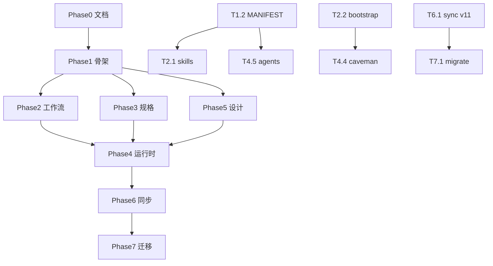

# Tasks — .claude 配置整合任务分解

> **执行顺序**：Phase 0→7 | **设计源**：仓库 PRIMARY | **关联**：[design.md](./design.md) | [spec.md](./spec.md)  
> **状态图例**：`[ ]` 待办 | `[~]` 进行中 | `[x]` 完成 | `[-]` 跳过

---

## 进度总览

| Phase | 名称 | 任务数 | 状态 | 里程碑 |
|-------|------|--------|------|--------|
| 0 | 设计文档 | 4 | [x] | M0 |
| 1 | PRIMARY 骨架 | 9 | [x] | M1 |
| 2 | 工作流链 | 8 | [x] | M2 |
| 3 | 规格体系 | 7 | [x] | M3 |
| 4 | 运行时层 | 10 | [x] | M4 |
| 5 | 设计层 | 4 | [x] | — |
| 6 | 同步层 | 8 | [x] | M5 |
| 7 | 本地迁移 | 6 | [x] | M6 |
| **8** | **v2.3 文档对齐 + Phase 8 实现** | **8** | **[x]** | **M7** |

---

## Phase 0 — 设计文档

| ID | 任务 | 来源 | 产出 | 验证 | 状态 |
|----|------|------|------|------|------|
| T0.1 | 编写 design.md（架构、目录树、边界矩阵、工作流） | 21 仓库分析 | spec/claude-config-integration/design.md | 含 mermaid + 21 仓库映射 | [x] |
| T0.2 | 编写 spec.md（FR/NFR + 21 仓库详表 + 验收清单） | 21 仓库分析 | spec/claude-config-integration/spec.md | FR-01~FR-15 完整 | [x] |
| T0.3 | 编写 tasks.md（本文件） | — | spec/claude-config-integration/tasks.md | Phase 0~7 完整 | [x] |
| T0.4 | 审查修订三件套：骨架表、FR 追溯、缺口修复 | — | design/spec/tasks v1.1 | design §18 自检 12 项 | [x] |

**Phase 0 门控**：三件套存在、互相链接、需求符合性自检 ✓

---

## Phase 1 — PRIMARY 骨架

> **依赖**：Phase 0 | **里程碑 M1**：MANIFEST 零冲突 + CLAUDE.md ≤200 行

| ID | 任务 | 来源 | 产出文件 | 验证 | 依赖 | 状态 |
|----|------|------|----------|------|------|------|
| T1.1 | 创建目标目录树（空骨架） | ECC | ~/.claude/{mcp-configs,templates,experiences/instincts,templates/openspec,templates/planning,templates/spec,templates/github-actions}/ | 目录存在 | T0.3 | [x] |
| T1.2 | 编写 MANIFEST.yaml 完整归属表（14 concern） | ECC + best-practice | MANIFEST.yaml | validate_config --check-manifest | T1.1 | [x] |
| T1.3 | 编写 agent.yaml harness manifest | ECC | agent.yaml | YAML 合法；列出 P0 skills/agents/hooks | T1.2 | [x] |
| T1.4 | 重写 CLAUDE.md 为路由层 ≤200 行 | best-practice + karpathy | CLAUDE.md | `(Get-Content CLAUDE.md).Count -le 200` | T1.2 | [x] |
| T1.5 | 编写 AGENTS.md 跨编辑器镜像（pointer 模式） | caveman | AGENTS.md | 不重复 CLAUDE 长文 | T1.4 | [x] |
| T1.6 | 合并 rules 为 8 文件（CORE/SECURITY/GIT/WORKFLOW/AGENTS/MCP/DESIGN/README） | ECC + 本地对照 | rules/*.md | alwaysApply frontmatter 正确 | T1.2 | [x] |
| T1.7 | 更新 SPEC.md：组件索引 + 21 仓库溯源 + catalog | 全部 | SPEC.md | 每个 P0 组件有 source_repo | T1.2~T1.6 | [x] |
| T1.8 | 更新 TOOL_MATCHING_GUIDE 与 mcp-configs 一致 | github-mcp + 本地 | TOOL_MATCHING_GUIDE.md | MCP 语义表对齐 | T1.1 | [x] |
| T1.9 | 创建 lazy-load rule 示例模板 | best-practice | templates/rules/typescript.lazy.md | paths: frontmatter 示例 | T1.6 | [x] |

### T1.4 CLAUDE.md 重写要点

保留（≤200 行）：
- 优先级链（3 行）
- 铁律 R1-R11 表（压缩版）
- HARD-GATE 一行
- 任务决策树（简单/非简单）
- P0 skill 4 个表
- 指针：SPEC.md / skills/ / agents/ / commands/ / MANIFEST.yaml
- 规格三轨一句话
- 同步说明一句话

移出到 SPEC.md：
- 完整 Skill/Agent/Hooks/MCP 列表
- 六步流详细步骤（→ skill/brainstorming）
- 上下文管理详细算法（→ skill/memory-compression）
- Karpathy 四原则全文（→ rules/CORE.md + skill/karpathy-guidelines）

### T1.6 rules 合并映射

| 新文件 | 合并来源 | 来源仓库 |
|--------|----------|----------|
| CORE.md | RULES_CORE + Karpathy 四原则 | karpathy-skills, 本地 |
| SECURITY.md | RULES_SECURITY + AgentShield | ECC |
| GIT.md | RULES_GIT | 本地 |
| WORKFLOW.md | RULES_WORKFLOW + GSD phase | GSD-redux, superpowers |
| AGENTS.md | RULES_AGENTS + MANIFEST 互斥 | ECC, best-practice |
| MCP.md | RULES_MCP | github-mcp-server |
| DESIGN.md | 新建 | awesome-design-md |

语言规则（PYTHON/TYPESCRIPT/GO 等）→ 项目级 `.claude/rules/` lazy-load。

**M1 门控**：
```
□ MANIFEST.yaml 零 conflict
□ CLAUDE.md ≤200 行
□ rules/ = 8 文件
□ agent.yaml 可解析
```

---

## Phase 2 — 工作流链

> **依赖**：Phase 1 | **里程碑 M2**：brainstorm → verify 链可跑通

| ID | 任务 | 来源 | 产出 | 验证 | 依赖 | 状态 |
|----|------|------|------|------|------|------|
| T2.1 | 从 superpowers 导入 13 core skills | superpowers | skills/*/SKILL.md ×13 | frontmatter name+description 合法 | T1.1 | [x] |
| T2.2 | 导入 session-start bootstrap hook（唯一） | superpowers | hooks/session-start-bootstrap.*, hooks.json | 仅 1 条 SessionStart | T2.1 | [x] |
| T2.3 | 对齐 commands 链 | superpowers + GSD | commands/{discuss,plan,execute,verify,ship}.md | 每命令 ≤50 行，pointer 到 skill | T2.1 | [x] |
| T2.4 | 导入 karpathy-guidelines skill | karpathy-skills | skills/karpathy-guidelines/SKILL.md | 四原则触发 | T2.1 | [x] |
| T2.5 | 导入 writing-skills + anthropics template | anthropics/skills | skills/writing-skills/, references/spec.md | 可按 template 建 skill | T2.1 | [x] |
| T2.6 | 更新 settings.json hooks 注册 | best-practice | settings.json | 与 hooks.json 一致 | T2.2 | [x] |
| T2.7 | 导入 meta skills（memory/karpathy/caveman/spec-validation） | 多仓库 | skills/ ×4~5 | 全局 ≤20；MANIFEST 对齐 | T2.1 | [x] |
| T2.8 | 补充 commands：compact/clear/status（上下文管理） | GSD-redux + 本地 | commands/{compact,clear,status}.md | FR-16 覆盖 | T2.3 | [x] |

### T2.1 13 skills 导入清单

| # | Skill | 源路径 | 本地路径 | 必含元素 |
|---|-------|--------|----------|----------|
| 1 | using-superpowers | superpowers/skills/using-superpowers | skills/using-superpowers/ | bootstrap 规则 |
| 2 | brainstorming | superpowers/skills/brainstorming | skills/brainstorming/ | HARD-GATE |
| 3 | writing-plans | superpowers/skills/writing-plans | skills/writing-plans/ | 计划模板 |
| 4 | executing-plans | superpowers/skills/executing-plans | skills/executing-plans/ | 检查点 |
| 5 | verification-before-completion | superpowers/skills/verification-before-completion | skills/verification-before-completion/ | 证据优先 |
| 6 | systematic-debugging | superpowers/skills/systematic-debugging | skills/systematic-debugging/ | 四阶段 |
| 7 | test-driven-development | superpowers/skills/test-driven-development | skills/test-driven-development/ | RED-GREEN |
| 8 | subagent-driven-development | superpowers/skills/subagent-driven-development | skills/subagent-driven-development/ | 两阶段 review |
| 9 | using-git-worktrees | superpowers/skills/using-git-worktrees | skills/using-git-worktrees/ | 并行隔离 |
| 10 | receiving-code-review | superpowers/skills/receiving-code-review | skills/receiving-code-review/ | 验证后实施 |
| 11 | requesting-code-review | superpowers/skills/requesting-code-review | skills/requesting-code-review/ | 审查上下文 |
| 12 | finishing-a-development-branch | superpowers/skills/finishing-a-development-branch | skills/finishing-a-development-branch/ | merge/PR |
| 13 | writing-skills | superpowers/skills/writing-skills | skills/writing-skills/ | TDD for docs |

### T2.7 meta skills 导入清单

| Skill | 源仓库 | 路径 |
|-------|--------|------|
| memory-compression | claude-mem | skills/memory-compression/ |
| karpathy-guidelines | karpathy-skills | skills/karpathy-guidelines/ |
| caveman-compress | caveman | skills/caveman-compress/ |
| spec-validation | OpenSpec | skills/spec-validation/ |
| ui-ux-pro-max | nextlevelbuilder | skills/ui-ux-pro-max/（optional） |

**M2 门控**：
```
□ 13 workflow + ≤7 meta skills 存在（总计 ≤20）
□ SessionStart → using-superpowers 唯一
□ P0 强制 4 skill 在 CLAUDE.md 声明
□ 「头脑风暴」触发 brainstorming
□ 「完成」触发 verification-before-completion
□ /plan 命令 pointer 到 writing-plans
□ /compact /clear commands 存在
```

---

## Phase 3 — 规格体系

> **依赖**：Phase 1 | **里程碑 M3**：/propose 创建 openspec change

| ID | 任务 | 来源 | 产出 | 验证 | 依赖 | 状态 |
|----|------|------|------|------|------|------|
| T3.1 | 创建 OpenSpec 模板四件套 | OpenSpec | templates/openspec/{proposal,design,tasks}.md + specs/.gitkeep | copy 后结构合法 | T1.1 | [x] |
| T3.2 | 创建 GSD-redux 阶段模板 | GSD-redux | templates/planning/{project,state,phase-SPEC,phase-CONTEXT,phase-PLAN}.md | 三文件职责分离 | T1.1 | [x] |
| T3.3 | 创建轻量 spec 三件套模板 | OpenSpec + 本地 | templates/spec/{spec,design,tasks}.md | 小功能可用 | T1.1 | [x] |
| T3.4 | 更新 commands/propose\|apply\|archive | OpenSpec | commands/propose.md, apply.md, archive.md | 路径 openspec/changes/ | T3.1 | [x] |
| T3.5 | 更新 spec/README 三轨边界 | — | spec/README.md | 决策树 + 互斥规则 | T3.1~T3.3 | [x] |
| T3.6 | 可选：task-master 模板 | claude-task-master | templates/taskmaster/ | optional 标记 | T3.1 | [x] |
| T3.7 | OpenSpec config.yaml 模板 | OpenSpec | templates/openspec/config.yaml | 可复制到项目 openspec/ | T3.1 | [x] |

### T3.5 spec/README 三轨决策树（写入文件）

```
收到功能需求
├─ 影响多模块 / brownfield / 需审批 → openspec/changes/<id>/  (/propose)
├─ 大功能 / 多阶段里程碑 / >2 周 → .planning/phases/XX-*/     (/plan + GSD)
└─ ≤3 文件 / 需求明确 / 小改动 → spec/<project>/              (/plan 轻量)
```

**M3 门控**：
```
□ templates/openspec/ 可 copy
□ /propose 说明指向 openspec/changes/
□ spec/README 三轨互斥清晰
```

---

## Phase 4 — 运行时层

> **依赖**：Phase 2, 3 | **里程碑 M4**：mem + RTK + caveman 生效

| ID | 任务 | 来源 | 产出 | 验证 | 依赖 | 状态 |
|----|------|------|------|------|------|------|
| T4.1 | 安装 claude-mem plugin | claude-mem | plugins/ + settings enabledPlugins | mem-search 可用 | T1.1 | [x] |
| T4.2 | 对齐 memory-compression skill 与 plugin | claude-mem | skills/memory-compression/SKILL.md | 职责互补不重复 | T4.1 | [x] |
| T4.3 | 实现 pre-rtk-rewrite hook | RTK | hooks/pre-rtk-rewrite.py | rtk 存在则重写；否则 passthrough | T1.1 | [x] |
| T4.4 | 导入 caveman-compress skill | caveman | skills/caveman-compress/SKILL.md | 长输出压缩触发 | T2.2 | [x] |
| T4.5 | 精选 8 核心 agents | superpowers + ECC | agents/*.md ×8 | ≤15 总数；MANIFEST 对齐 | T1.2 | [x] |
| T4.6 | 配置 mcp-configs/ 分组 | ECC + github-mcp | mcp-configs/{core,dev,ops}.json | 与 .mcp.json 一致 | T1.1 | [x] |
| T4.7 | 配置 hooks profile | ECC | hooks/README.md + ECC_HOOK_PROFILE 文档 | minimal 仅 lifecycle | T4.3 | [x] |
| T4.8 | 配置 stop-quality-gate + stop-pattern-extraction + pre-compact-state | ECC + claude-mem + GSD | hooks/stop-*.py, pre-compact-state.py | patterns/ 写入；FR-16 | T4.1 | [x] |
| T4.9 | 确认 _editor_hook_launcher v3 | 本地参考 | hooks/_editor_hook_launcher.py | 编辑器环境 skipped | T4.7 | [x] |

### T4.5 8 核心 agents

| Agent | 来源 | 预加载 skills | 职责边界 |
|-------|------|---------------|----------|
| planner.md | superpowers | writing-plans | 仅计划，不实现 |
| code-explorer.md | ECC | — | 只读探索 |
| code-reviewer.md | superpowers | requesting-code-review, receiving-code-review | 审查不改代码 |
| build-error-resolver.md | ECC | systematic-debugging | 构建错误 |
| architect.md | ECC | brainstorming | 架构决策 |
| spec-reviewer.md | OpenSpec | spec-validation | spec 审查 |
| context-manager.md | claude-mem | memory-compression | 仅检索/持久化 |
| agentic-orchestrator.md | ECC | subagent-driven-development | 仅多 Agent 并行 |

语言 reviewer（go/rust/java 等）→ 按需项目级 agents/，不进全局。

### T4.7 hooks profile 定义

| Profile | 启用 hooks | 场景 |
|---------|------------|------|
| minimal | session-start, pre-bash-guard, post-secret-detector, stop-quality-gate | 日常/编辑器 |
| standard | + pre-rtk-rewrite, stop-pattern-extraction, pre-prompt-guard | 默认 Claude Code |
| strict | + pre-token-budget, pre-commit-quality, pre-dep-checker | 安全敏感 |

**M4 门控**：
```
□ claude-mem 跨会话检索
□ RTK passthrough/压缩
□ caveman-compress 可触发
□ agents ≤15
□ ECC_HOOK_PROFILE=minimal 可切换
```

---

## Phase 5 — 设计层

> **依赖**：Phase 1

| ID | 任务 | 来源 | 产出 | 验证 | 依赖 | 状态 |
|----|------|------|------|------|------|------|
| T5.1 | 创建 DESIGN.md YAML 模板 | awesome-design-md | templates/DESIGN.md | colors/typography/spacing/components | T1.1 | [x] |
| T5.2 | 编写 rules/DESIGN.md 使用规范 | awesome-design-md | rules/DESIGN.md | 与 FRONTEND 分离 | T1.6 | [x] |
| T5.3 | 导入 ui-ux-pro-max skill（optional） | nextlevelbuilder | skills/ui-ux-pro-max/ | search 脚本可运行 | T2.1 | [x] |
| T5.4 | 创建 claude-code-action CI 模板 | anthropic/claude-code-action | templates/github-actions/claude-code-action.yml | YAML 合法 | T1.1 | [x] |

---

## Phase 6 — 同步层

> **依赖**：Phase 1~5 | **里程碑 M5**：三编辑器无冲突

| ID | 任务 | 来源 | 产出 | 验证 | 依赖 | 状态 |
|----|------|------|------|------|------|------|
| T6.1 | 升级 sync.ps1 v11：CLAUDE.md 软链接 | caveman | scripts/sync.ps1 | -DryRun 通过 | T1.4 | [x] |
| T6.2 | Cursor AGENTS.md 映射 | best-practice | sync.ps1 | ~/.cursor 软链正确 | T6.1 | [x] |
| T6.3 | Windsurf global_rules ≤6000 摘要 | 本地参考 | sync.ps1 | 字符数检查 | T6.1 | [x] |
| T6.4 | 更新 SYNC_GUIDE.md | — | SYNC_GUIDE.md | 同步项含 CLAUDE.md | T6.1 | [x] |
| T6.5 | 升级 validate_config.py | — | scripts/validate_config.py | MANIFEST+skill lint | T1.2 | [x] |
| T6.6 | 三编辑器加载验证 | — | 验证报告 | 无 hook 循环 | T6.1~T6.4 | [x] |
| T6.7 | 升级 sync.sh v11 与 sync.ps1 对齐 | caveman | scripts/sync.sh | macOS/Linux DryRun | T6.1 | [-] |
| T6.8 | SPEC.md catalog：ComposioHQ + awesome-claude-code + anthropics doc skills | P1/P2 仓库 | SPEC.md | 外链索引完整 | T1.7 | [x] |

### T6.1 sync.ps1 v11 变更点

```powershell
# 新增 SYNC_FILES
$SYNC_FILES = @("CLAUDE.md", "AGENTS.md")
$SYNC_DIRS  = @("skills", "agents")
# rules/ 仍 FormatConvert 复制
# 不同步：hooks, commands, .mcp.json, settings.json, plugins/
```

### T6.6 编辑器验证清单

| 编辑器 | 检查项 | 通过标准 |
|--------|--------|----------|
| Cursor | AGENTS.md 软链 | 规则加载 |
| Cursor | skills/agents junction | skill 可发现 |
| Windsurf | global_rules | ≤6000 字符 |
| Windsurf | rules/ 复制 | 项目规则可用 |
| Trae | CLAUDE.md 软链 | user_rules 加载 |
| 全部 | hooks 未同步 | 无循环/延迟 |

**M5 门控**：
```
□ sync.ps1 -DryRun 零错误
□ validate_config.py 零错误
□ 三编辑器验证清单全通过
```

---

## Phase 7 — 本地迁移

> **依赖**：Phase 6 | **里程碑 M6**：legacy 审计 + 零优点丢失

| ID | 任务 | 来源 | 产出 | 验证 | 依赖 | 状态 |
|----|------|------|------|------|------|------|
| T7.1 | 编写 migrate-from-legacy.py | — | scripts/migrate-from-legacy.py | --dry-run 可执行 | T6.5 | [x] |
| T7.2 | 审计 ~120 skills → keep/deprecate/project | 本地对照 | experiences/rejected/skills-audit.md | 清单完整 | T7.1 | [x] |
| T7.3 | 审计 ~56 agents → 保留 ≤15 + reviewer | 本地对照 | agents/README.md deprecated 段 | 无 duplicate owner | T7.1 | [x] |
| T7.4 | 审计 ~50 hooks → 8 核心 + profile | 本地对照 | hooks/README.md | profile 可控 | T7.1 | [x] |
| T7.5 | 有效 legacy patterns → experiences/patterns/ | 本地参考 | experiences/patterns/*.md | 不丢失有效模式 | T7.2~T7.4 | [x] |
| T7.6 | 生成需求符合性验收报告（对照 design §18） | — | spec/claude-config-integration/compliance.md | 12 项全记录 | T7.5 | [x] |

### T7.2 skills 审计规则

| 判定 | 条件 | 处置 |
|------|------|------|
| KEEP global | 在 superpowers 13 或 P0 列表 | 保留 |
| MOVE project | domain skill（api-development 等） | → 文档说明放项目 .claude/skills/ |
| DEPRECATE | 与 superpowers 13 重复 | → experiences/rejected/ + deprecated 标记 |
| CATALOG | ComposioHQ 类 SaaS skill | → SPEC.md 外链索引 |

### T7.3 agents 保留清单

**保留全局**（8 核心，见 T4.5）+ **可选语言 reviewer**（项目级）：

- deprecated：与 planner/orchestrator 职责重叠的 planning-expert 全局版
- deprecated：context-compressor（→ memory-compression skill + claude-mem）
- 保留项目级：frontend-developer, backend-developer 等 → 文档说明不放全局

**M6 门控**：
```
□ migrate-from-legacy.py --dry-run 输出完整
□ deprecated 清单存在
□ experiences/patterns/ 有迁移记录
□ 无 superpowers 13 重复 skill 留全局
```

---

## 任务 DAG



---

## 并行执行建议

| 可并行组 | 任务 | 条件 |
|----------|------|------|
| A | T3.1, T3.2, T3.3, T3.7, T5.1, T5.4, T1.9 | Phase 1 完成后 |
| B | T2.7, T4.3, T4.4, T5.3 | Phase 2 T2.1 完成后 |
| C | T7.2, T7.3, T7.4 | T7.1 完成后 |

---

## 验证命令速查

```powershell
# 行数
(Get-Content $env:USERPROFILE\.claude\CLAUDE.md).Count

# 配置校验
python $env:USERPROFILE\.claude\scripts\validate_config.py
python $env:USERPROFILE\.claude\scripts\validate_config.py --check-manifest

# 同步预览
powershell -ExecutionPolicy Bypass -File $env:USERPROFILE\.claude\scripts\sync.ps1 -DryRun

# Legacy 审计预览
python $env:USERPROFILE\.claude\scripts\migrate-from-legacy.py --dry-run

# skills 计数
(Get-ChildItem $env:USERPROFILE\.claude\skills -Recurse -Filter SKILL.md).Count

# agents 计数
(Get-ChildItem $env:USERPROFILE\.claude\agents -Filter *.md).Count
```

---

## 里程碑汇总

| 里程碑 | 完成 Phase | 门控条件 | 阻塞下一 Phase |
|--------|------------|----------|----------------|
| M0 文档 | 0 | design/spec/tasks 三件套 | Phase 1 |
| M1 骨架 | 1 | MANIFEST 零冲突 + CLAUDE≤500 | Phase 2/3/5 |
| M2 工作流 | 2 | 13 skills + bootstrap + 链可触发 | Phase 4 |
| M3 规格 | 3 | templates + /propose 路径 | Phase 4 |
| M4 运行时 | 4 | mem + RTK + caveman + agents≤22 | Phase 6 |
| M5 同步 | 6 | sync DryRun + 三编辑器 | Phase 7 |
| M6 迁移 | 7 | legacy 审计 + patterns 保留 + compliance 报告 | Phase 8 |
| M7 整合 | 8 | 24 仓库追溯全 ✅ + validate 8 checks | Phase 9 |
| M8 Round2 | 9 | mattpocock 全局 2 + 文档对齐 | Phase 10 |
| M9 Round3 | 10–12 | P3 安全补强 + validate PASS | 完成 |

---

---

## Phase 8 — v2.3 文档对齐 + Phase 8 实现

> **依赖**：Phase 7 | **里程碑 M7**：22 仓库追溯全 ✅ + validate

| ID | 任务 | 来源 | 产出 | 验证 | 状态 |
|----|------|------|------|------|------|
| T8.1 | design.md v2.3：§4/§9/§16 漂移 + §15.5 追溯矩阵 | 用户要求 | design.md | §18 自检 | [x] |
| T8.2 | spec.md v2.3：FR-03.7 + 验收清单 | — | spec.md | FR-03.7, FR-11.2 | [x] |
| T8.3 | SPEC.md mattpocock catalog 索引 | mattpocock/skills | SPEC.md | migrate 示例 | [x] |
| T8.4 | catalog 导入 diagnose / grill-with-docs / handoff | mattpocock/skills | catalog/skills/ ×3 | 仅 catalog/ | [x] |
| T8.5 | templates/taskmaster/ 轻量模板 | claude-task-master | README + example_prd | T3.6 完成 | [x] |
| T8.6 | mcp-configs/dev.json optional + rules/CONTEXT 启用 | claude-context | dev.json, CONTEXT.md | FR-11.2 | [x] |
| T8.7 | tasks.md v2.3 里程碑 + Phase 8 扩展 | — | tasks.md | M1/M4/M7 | [x] |
| T8.8 | SYNC_GUIDE + compliance v2.3 | — | SYNC_GUIDE, compliance.md | agents 20 | [x] |

**M7 门控**：
```
□ design/spec/tasks v2.3 互链
□ design §15.5 追溯矩阵 22 行
□ mattpocock 3 skill 仅 catalog/
□ validate_config.py 8 checks PASS
□ sync.ps1 -DryRun 零错误
```

---

## 22 仓库 → 任务映射速查

| 仓库 | 主要任务 ID |
|------|-------------|
| superpowers | T2.1, T2.2, T2.3, T4.5 |
| anthropics/skills | T2.5, T2.7, T6.8, T6.5 |
| ECC | T1.2, T1.3, T1.6, T4.5, T4.7 |
| best-practice | T1.4, T1.5, T1.9, T2.6, T6.2 |
| claude-mem | T4.1, T4.2, T4.8 |
| OpenSpec | T3.1, T3.4, T3.7, T2.7 spec-validation |
| GSD-redux | T3.2, T1.6 WORKFLOW, T2.8, T4.8 pre-compact |
| karpathy-skills | T2.4, T2.7, T1.6 CORE |
| RTK | T4.3 |
| caveman | T2.7, T4.4, T6.1, T6.7 |
| awesome-design-md | T5.1, T5.2 |
| ui-ux-pro-max | T2.7, T5.3 |
| github-mcp-server | T4.6, T1.8 |
| claude-context | T4.6, T8.6 |
| claude-code-action | T5.4 |
| claude-task-master | T3.6, T8.5 |
| ComposioHQ | T6.8, T7.2 CATALOG |
| hesreallyhim/awesome-claude-code | T6.8 |
| 30-seconds-of-code | T2.5 skills README |
| x1xhlol | T6.8 索引 only |
| deer-flow | T6.8 注明非 IDE |
| mattpocock/skills | T8.1–T8.4 |
| 本地 legacy | T7.1~T7.6 |

---

_version：2.4 | 日期：2026-05-26 | Phase 10–12 Round 3_

---

## Phase 9 — Round 2 收尾（mattpocock 全局 2）

> **依赖**：Phase 8 | **里程碑 M8**

| ID | 任务 | 来源 | 产出 | 验证 | 状态 |
|----|------|------|------|------|------|
| T9.1 | skills/triage/SKILL.md | mattpocock/skills | skills/triage/ | 文件存在 | [x] |
| T9.2 | skills/improve-codebase-architecture/SKILL.md | mattpocock/skills | skills/improve-codebase-architecture/ | 文件存在 | [x] |
| T9.3 | CLAUDE.md 决策树 + mattpocock 表 | — | CLAUDE.md | triage 路由 | [x] |
| T9.4 | SPEC.md skills 27/28 | — | SPEC.md | 规模表 | [x] |
| T9.5 | MANIFEST triage + architecture_improvement | — | MANIFEST.yaml | YAML valid | [x] |
| T9.6 | rules/CONTEXT.md 50% 措辞 | GSD-redux | rules/CONTEXT.md | grep compact | [x] |

---

## Phase 10 — 文档 v2.4 + P3 来源同步

> **依赖**：Phase 9 | **里程碑 M9 文档**

| ID | 任务 | 来源 | 产出 | 验证 | 状态 |
|----|------|------|------|------|------|
| T10.1 | design.md v2.4 §15.6 P3 表 | P3 仓库 | design.md | §18 自检 | [x] |
| T10.2 | spec.md FR-18/19/20 | — | spec.md | FR 完整 | [x] |
| T10.3 | design-round3.md | — | design-round3.md | 来源索引 | [x] |
| T10.4 | compliance.md v2.4 | — | compliance.md | #29 #30 | [x] |
| T10.5 | SPEC.md P3 外链 + compound 注明 | efij/EveryInc | SPEC.md | 溯源 | [x] |

---

## Phase 11 — 运行时补强

> **依赖**：Phase 10

| ID | 任务 | 来源 | 产出 | 验证 | 状态 |
|----|------|------|------|------|------|
| T11.1 | validate_config skills=28 + mattpocock 2 | 本地 | validate_config.py | skills=27 PASS | [x] |
| T11.2 | settings.json deny + defaultMode | trailofbits | settings.json | deny 凭证路径 | [x] |
| T11.3 | SECURITY.md §11–14 | ToB + marc-shade | rules/SECURITY.md | ≤120 行 | [x] |
| T11.4 | 可选 hooks ×2 | dwarvesf + lasso | hooks/_optional/ | strict profile | [x] |
| T11.5 | hooks/tests/fixtures | disler | hooks/tests/ | README | [x] |
| T11.6 | AGENTS.md + agent.yaml + MANIFEST P3 | — | 多文件 | triage 镜像 | [x] |
| T11.7 | WORKFLOW/AGENTS ruflo 吸收 | ruflo | rules/ | ≤10 行/文件 | [x] |
| T11.8 | templates/openspec/specs/.gitkeep | OpenSpec | templates/ | 目录存在 | [x] |
| T11.9 | templates/devcontainer/README | trailofbits | templates/devcontainer/ | 指针 | [x] |

---

## Phase 12 — 验证

| ID | 任务 | 验证 | 状态 |
|----|------|------|------|
| T12.1 | validate_config.py | ALL PASS skills=27 | [x] |
| T12.2 | sync.ps1 -DryRun | 零错误 | [x] |
| T12.3 | trigger 互博 grep | triage/debugging | [x] |
| T12.4 | P3 source 三处 grep | MANIFEST + design + SPEC | [x] |
| T12.5 | tasks-round2.md 勾选 | Task 4–9 [x] | [x] |

**M9 门控**：
```
□ validate_config V1–V9 PASS
□ skills=27 agents=20
□ P3 concerns 在 MANIFEST 有 source
□ sync.ps1 -DryRun 零错误
```
