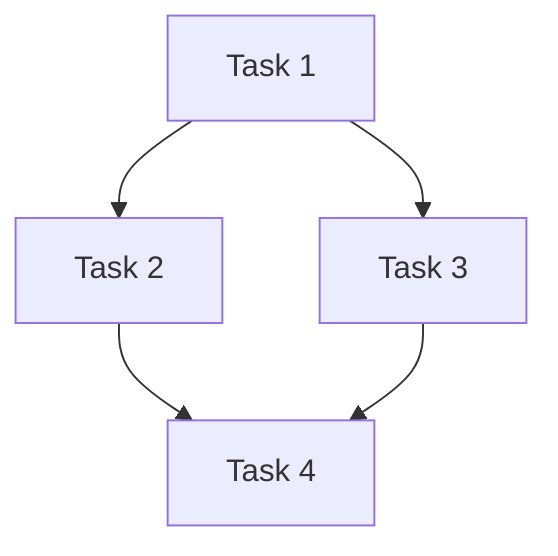

# Tasks: {{change_id}}

> OpenSpec 任务分解。每个任务独立可验证。
> 模板源：Fission-AI/OpenSpec + eyaltoledano/claude-task-master

## 依赖图



## 任务清单

| ID | 任务 | 涉及文件 | 验收标准 | 依赖 | 状态 |
|----|------|----------|----------|------|------|
| T1 | | | | — | [ ] |
| T2 | | | | T1 | [ ] |
| T3 | | | | T1 | [ ] |
| T4 | | | | T2, T3 | [ ] |

## 并行策略

- **可并行**: T2 ⟷ T3
- **关键路径**: T1 → T2/T3 → T4

## 验证命令

```bash
# T1 验证
# T2 验证
# T3 验证
# T4 验证

# 整体验证
```

## 验收清单

- [ ] 所有任务通过验收标准
- [ ] 无回归
- [ ] 文档已更新 
